# Lab 1:  Create a Microsoft Fabric Lakehouse

## Estimated Duration: 30 minutes

In this lab, you will explore how to build and work with a lakehouse in Microsoft Fabric. You will begin by creating a Fabric lakehouse that leverages OneLake as its storage layer and supports Delta Lake tables for structured querying. You'll learn how to use Apache Spark to process and analyze data stored in the lakehouse, and how to implement a medallion architecture that organizes data into bronze, silver, and gold layers for improved clarity, performance, and insight.

## Lab Objectives

In this lab, you will be able to complete the following tasks:

- Task 1: Create a lakehouse
- Task 2: Upload a file
- Task 3: Explore shortcuts
- Task 4: Load file data into a table
- Task 5: Use SQL to query tables
- Task 6: Create a visual query
- Task 7: Create a report

### Task 1: Create a lakehouse

In this task, you will create a lakehouse in your Microsoft Fabric workspace. 

1. Return to your workspace and click the **+ New item (1)** icon.  

2. On the **All items** page, scroll down to the **Store data** section and select **Lakehouse (2)**.  

     

3. Provide the following details to create a **Lakehouse**:  

   - **Name:** Enter **lakehouse<inject key="DeploymentID" enableCopy="false"/>**  

4. Click **Create** to proceed.  

5. View the new lakehouse, and note that the **Lakehouse explorer** pane on the left enables you to browse tables and files in the lakehouse:

    - The **Tables** folder contains tables that you can query using SQL semantics. Tables in a Microsoft Fabric lakehouse are based on the open source *Delta Lake* file format, commonly used in Apache Spark.

    - The **Files** folder contains data files in the OneLake storage for the lakehouse that aren't associated with managed delta tables. You can also create *shortcuts* in this folder to reference data that is stored externally.

   

   >**Note**: Currently, there are no tables or files in the lakehouse.

### Task 2: Upload a file

In this task, you will upload a data file into your newly created lakehouse. Microsoft Fabric supports various methods for ingesting data, but to get started quickly, you'll use the built-in file upload feature to bring in a local file.

1. Return to the web browser tab containing your lakehouse, and in the **... (1)** menu for the **Files** folder in the **Lakehouse explorer** pane, select **New subfolder (2)**, and create a subfolder named **data (3)**.

   

   

3. In the **... (1)** menu for the new **data** folder, select **Upload (2)** and **Upload files (3)**, and then upload the **sales.csv** (C:\LabFiles\Files\) file located in the Lab VM.

    

    

4. After the file has been uploaded, select the **Files/data** folder and verify that the **sales.csv** file has been uploaded, as shown here:

5. Select the **sales.csv** file to see a preview of its contents.

    

### Task 3: Explore shortcuts

In this task, you'll explore how to use shortcuts in Microsoft Fabric lakehouses. Shortcuts allow you to reference external data sources directly in your lakehouse without physically copying the data. This approach reduces storage duplication and maintains a single source of truth, which is especially useful when working with large or frequently updated datasets.

1. In the **... (1)** menu for the **Files** folder, select **New shortcut (2)**.

    

2. View the available data source types for shortcuts. Then close the **New shortcut** dialog box without creating a shortcut.

### Task 4: Load file data into a table

In this task, you’ll learn how to convert raw file data into a structured table within your lakehouse. While data in files can be directly accessed using Apache Spark, loading it into a table makes it easier to analyze using SQL and integrate with other structured data assets.

1. On the **Home** page, select the **Files/Data** folder so you can see the **sales.csv** file it contains.

2. In the **...** menu for the **sales.csv** file, select **Load to Tables (1)** > **New table (2)**.

    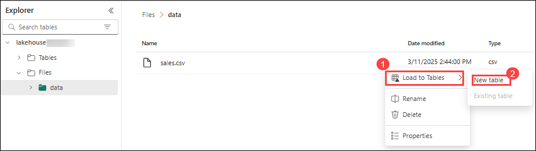

3. In **Load to table** dialog box, set the table name to **sales (1)** and confirm the **Load (2)** operation. Then wait for the table to be created and loaded.

    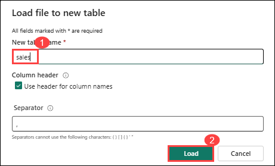

    > **Tip**: If the **sales** table does not automatically appear, in the **...** menu for the **Tables** folder, select **Refresh**.

3. In the **Lakehouse explorer** pane, select the **sales** table that has been created to view the data.

    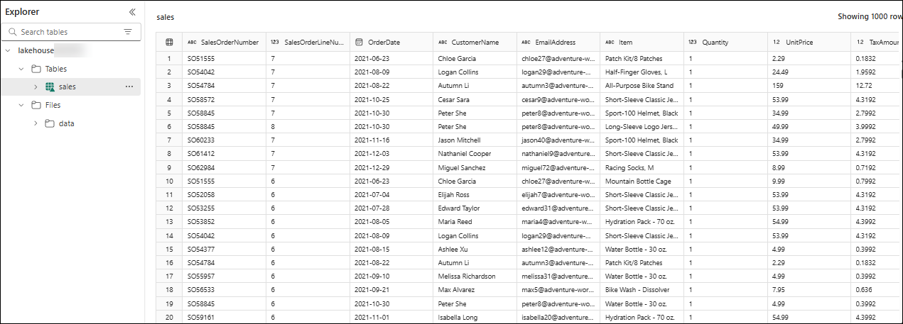

4. In the **...** menu for the **sales** table, select **View files** to see the underlying files for this table

    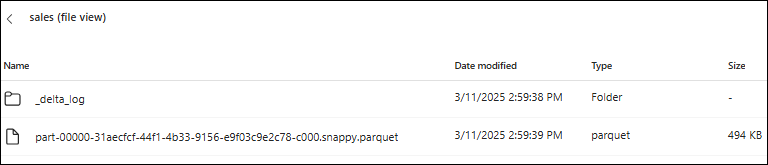

    >**Note**: Files for a delta table are stored in *Parquet* format, and include a subfolder named **_delta_log** in which details of transactions applied to the table are logged.

### Task 5: Use SQL to query tables

In this task, you’ll learn how to analyze your lakehouse tables using familiar SQL syntax. Microsoft Fabric automatically creates a SQL analytics endpoint for each lakehouse, allowing you to run queries without needing to write Spark code.

1. At the top-right of the Lakehouse page, switch from **Lakehouse** to **SQL analytics endpoint**. Then wait a short time until the SQL analytics endpoint for your lakehouse opens in a visual interface from which you can query its tables.

    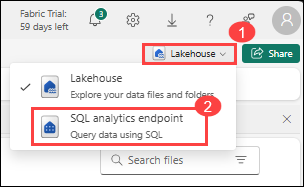

2. Use the **New SQL query** button to open a new query editor, and enter the following SQL query (1):

    ```sql
   SELECT Item, SUM(Quantity * UnitPrice) AS Revenue
   FROM sales
   GROUP BY Item
   ORDER BY Revenue DESC;
    ```
    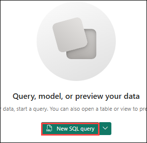

    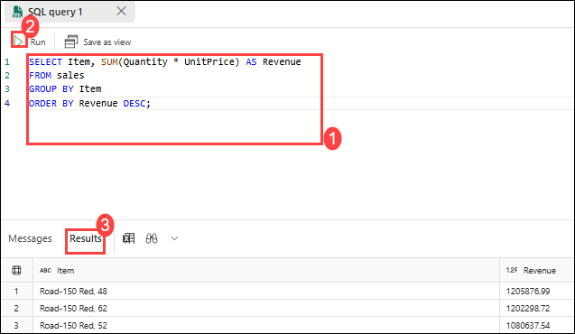

3. Use the **&#9655; Run (2)** button to run the query and view the **Results (3)**, which should show the total revenue for each product.

### Task 6: Create a visual query

In this task, you’ll explore how to perform data transformation and analysis using a no-code, visual experience through Power Query in Microsoft Fabric. This method is especially useful for users who are comfortable with tools like Power BI but may not be fluent in SQL.

1. On the toolbar, expand the **New SQL query (1)** option and select **New visual query (2)**.

    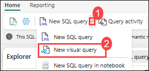

2. Drag the **sales** table to the new visual query editor pane that opens to create a Power Query as shown here: 

    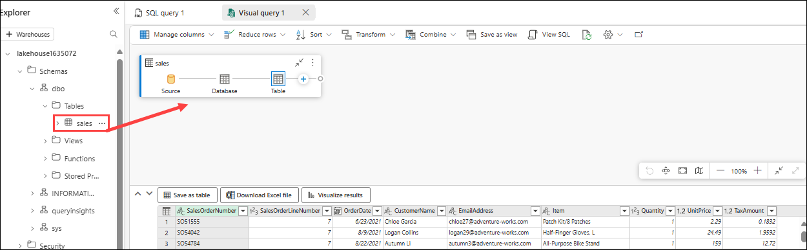

3. In the **Manage columns (1)** menu, select **Choose columns (2)**. Then select only the **SalesOrderNumber (3)** and **SalesOrderLineNumber (4)** columns.

    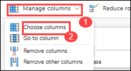

    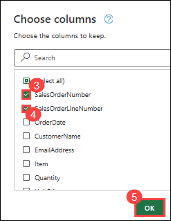

4. In the **Transform** menu, select **Group by**. Then group the data by using the following **Basic** settings:

    - **Group by**: SalesOrderNumber
    - **New column name**: LineItems
    - **Operation**: Count distinct values
    - **Column**: SalesOrderLineNumber

    >**Note**: When you're done, the results pane under the visual query shows the number of line items for each sales order.

### Task 7: Create a report

In this task, you’ll build a simple Power BI report directly within Microsoft Fabric using the data from your lakehouse. When tables are created in a lakehouse, they’re automatically added to a semantic model that enables reporting and visualization without needing additional configuration.

1. In the toolbar, select **Model layouts (1)**. The data model schema for the semantic model is shown.

    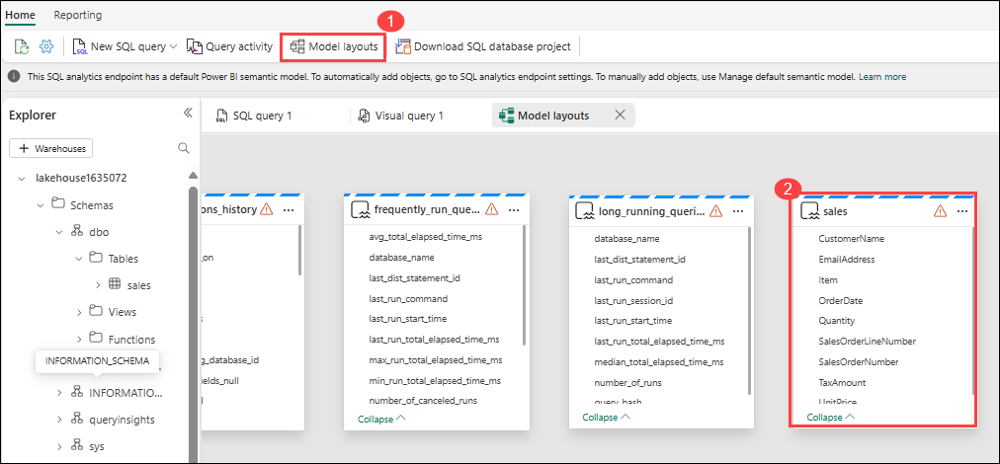

    > **Note 1**: In this exercise, the semantic model consists of a single table. In a real-world scenario, you would likely create multiple tables in your lakehouse, each of which would be included in the model. You could then define relationships between these tables in the model.
    
    > **Note 2**: The views **frequently_run_queries**, **long_running_queries**, **exec_sessions_history**, and **exec_requests_history** are part of the **queryinsights** schema automatically created by Fabric. It is a feature that provides a holistic view of historical query activity on the SQL analytics endpoint. Since this feature is out of the scope of this exercise, those views should be ignored for now.

2. In the menu ribbon, select the **Reporting (1)** tab. Then select **New report**. Your current page will change to a report designer view.

    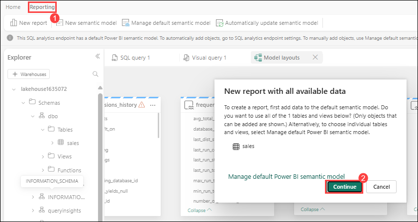

3. In the **Data** pane on the right, expand the **sales (1)** table. Then select the following fields:
    - **Item (2)**
    - **Quantity (3)**

    >**Note**: A table visualization is added to the report:

    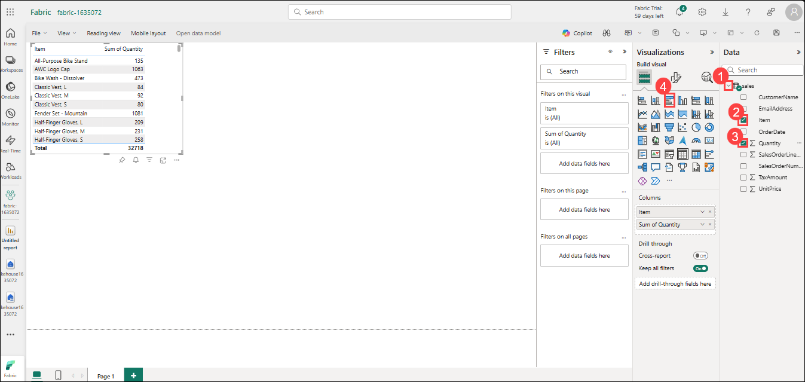

4. Hide the **Data** and **Filters** panes to create more space. Then ensure the table visualization is selected and in the **Visualizations** pane, change the visualization to a **Clustered bar chart (4)** and resize it as shown here.

    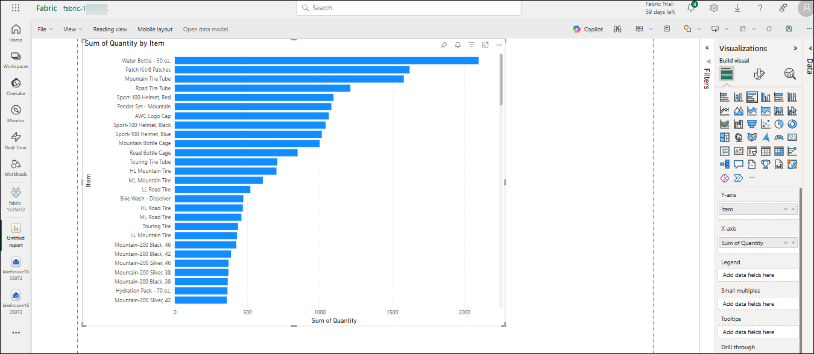

5. On the **File** menu, select **Save**. Then save the report as `Item Sales Report` (1) in the workspace you created previously.

    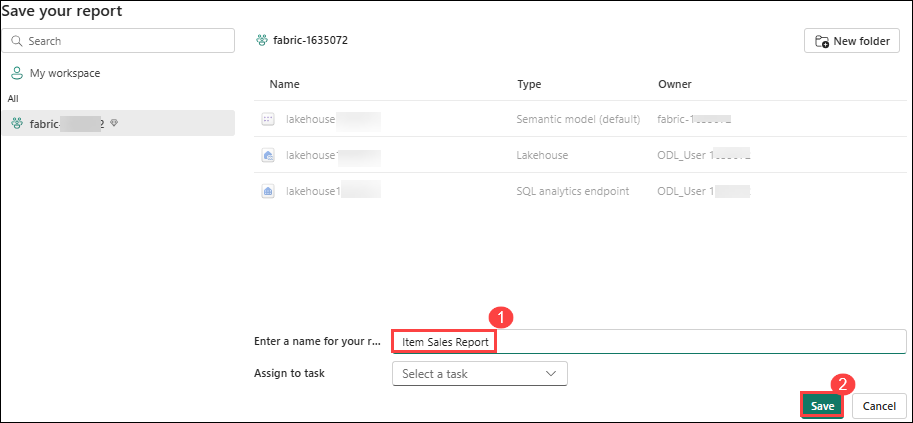

6. Now, in the hub menu bar on the left, select your workspace to verify that it contains the following items:
    - Your lakehouse.
    - The SQL analytics endpoint for your lakehouse.
    - A default semantic model for the tables in your lakehouse.
    - The **Item Sales Report** report.

    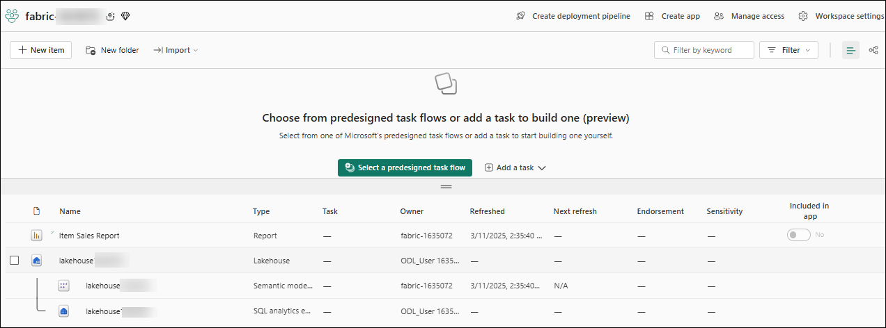


## Review

In this lab, you explored the core features of Microsoft Fabric's Lakehouse architecture. You learned how to create a lakehouse and upload data files, then explored how to use shortcuts to connect external data sources without duplication. You transformed raw data into structured tables and queried it using both SQL and visual tools. Finally, you created an interactive report using Power BI capabilities integrated within Fabric.

In this lab, you have completed the following tasks:

- Create a lakehouse
- Uploaded a file
- Explored shortcuts
- Loaded file data into a table
- Used SQL to query tables
- Created a visual query
- Created a report


## Now, click on Next from the lower right corner to move on to the next lab.