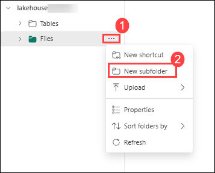
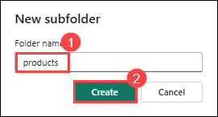
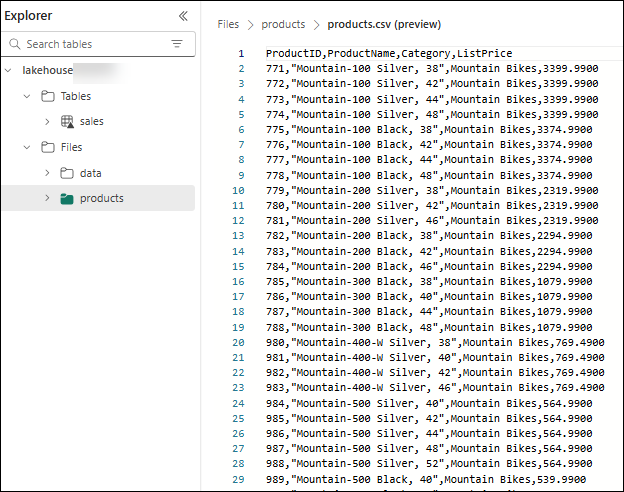
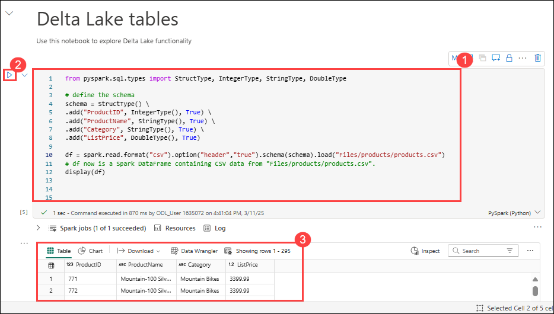
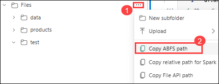
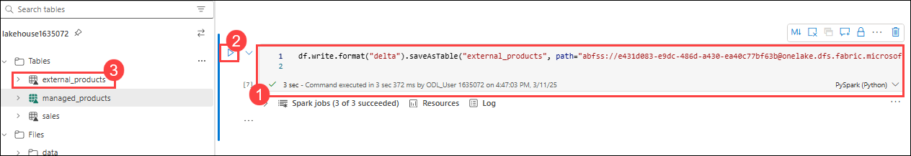

# Lab 2: Use Delta Tables in Apache Spark

## Estimated Duration: 75 minutes

In this lab, you will learn how to use Delta Tables in Microsoft Fabric Lakehouse for managing batch and streaming data. You’ll work with Apache Spark to create and query Delta Tables using SQL. The lab highlights key Delta Lake features like schema enforcement and ACID transactions. By the end, you’ll understand how to use Delta Tables for reliable, scalable data processing in a lakehouse environment.

## Lab Objectives

In this lab, you will be able to complete the following tasks:

- Task 1: Upload data to the Lakehouse
- Task 2: Explore data in a DataFrame
- Task 3: Create Delta tables
- Task 4: Create a managed table
- Task 5: Create an external table
- Task 6: Compare managed and external tables
- Task 7: Use SQL to create a Delta table
- Task 8: Explore table versioning
- Task 9: Analyze Delta table data with SQL queries
- Task 10: Use Delta tables for streaming data


### Task 1: Upload data to the Lakehouse

In this task, you will create a new lakehouse within your Microsoft Fabric workspace and upload sample data files into it. 

1. Return to the web browser tab containing your lakehouse, and in the Explorer pane, next to the **Files** folder, select the **… (1)** menu. Create a **New subfolder** called *products (3)*.

    

    

1.	In the … menu for the products folder, **upload** the *products.csv*(C:\LabFiles\Files\) file located in the Lab VM.

1.	After the file has been uploaded, select the **products** folder to verify that the file has been uploaded, as shown here:

    
  
### Task 2: Explore data in a DataFrame

In this task, you'll begin working with a notebook in Microsoft Fabric to explore Delta Lake functionality using Apache Spark. You’ll first add explanatory markdown text to describe your notebook, then use PySpark to define a schema and read CSV data into a DataFrame. 

1. Create a **New notebook**. After a few seconds, a new notebook containing a single cell will open. Notebooks are made up of one or more cells that can contain code or markdown (formatted text).

2. Select the first cell (which is currently a code cell), and then in the top-right tool bar, use the **M↓** button to convert it to a markdown cell. The text contained in the cell will then be displayed as formatted text. Use markdown cells to provide explanatory information about your code.

3. Use the 🖉 (Edit) button to switch the cell to editing mode, then modify the markdown as follows:

    ```markdown
    # Delta Lake tables 
    Use this notebook to explore Delta Lake functionality 
    ```

4. Click anywhere in the notebook outside of the cell to stop editing it and see the rendered markdown.

5. Add a new code cell, and add the following code to read the products data into a DataFrame using a defined schema:

    ```python
    from pyspark.sql.types import StructType, IntegerType, StringType, DoubleType

    # define the schema
    schema = StructType() \
    .add("ProductID", IntegerType(), True) \
    .add("ProductName", StringType(), True) \
    .add("Category", StringType(), True) \
    .add("ListPrice", DoubleType(), True)

    df = spark.read.format("csv").option("header","true").schema(schema).load("Files/products/products.csv")
    # df now is a Spark DataFrame containing CSV data from "Files/products/products.csv".
    display(df)
    ```

   >**Tip**: Hide or display the explorer panes by using the chevron « icon. This enables you to either focus on the notebook, or your files.

6. Use the **Run cell** (▷) button on the left of the cell to run it.

   >**Note**: Since this is the first time you’ve run any code in this notebook, a Spark session must be started. This means that the first run can take a minute or so to complete. Subsequent runs will be quicker.

7. When the cell code has completed, review the output below the cell, which should look similar to this:

    
 
### Task 3: Create Delta tables

In this task, you’ll learn how to persist DataFrames as Delta tables using the saveAsTable method in Apache Spark. Delta Lake supports the creation of both managed and external tables:

   * **Managed** Delta tables benefit from higher performance, as Fabric manages both the schema metadata and the data files.

   * **External** tables allow you to store data externally, with the metadata managed by Fabric.

### Task 4: Create a managed table

In this task, you'll create a managed Delta table by writing the DataFrame to your lakehouse using the saveAsTable method. 

The data files are created in the **Tables** folder.

1. Under the results returned by the first code cell, use the + Code icon to add a new code cell.

   >**Tip**: To see the + Code icon, move the mouse to just below and to the left of the output from the current cell. Alternatively, in the menu bar, on the Edit tab, select **+ Add code cell**.

2. To create a managed Delta table, add a new cell, enter the following code and then run the cell:

    ```python
    df.write.format("delta").saveAsTable("managed_products")
    ```

3. In the Lakehouse explorer pane, **Refresh** the Tables folder and expand the Tables node to verify that the **managed_products** table has been created.

   >**Note**: The triangle icon next to the file name indicates a Delta table.

The files for managed tables are stored in the **Tables** folder in the lakehouse. A folder named *managed_products* has been created which stores the Parquet files and delta_log folder for the table.

### Task 5: Create an external table

In this task, you'll create an external Delta table, where the data files are stored in a specified location (such as a folder in your lakehouse), while the table schema is maintained by Microsoft Fabric.

1. In the Lakehouse explorer pane, in the … menu for the **Files** folder, select **Copy ABFS path**. The ABFS path is the fully qualified path to the lakehouse Files folder.

   

2. In a new code cell, paste the ABFS path. Add the following code, using cut and paste to insert the abfs_path into the correct place in the code:

    ```python
    df.write.format("delta").saveAsTable("external_products", path="abfs_path/external_products")
    ```

3. The full path should look similar to this:

    ```python
    abfss://workspace@tenant-onelake.dfs.fabric.microsoft.com/lakehousename.Lakehouse/Files/external_products
    ```

4. **Run (2)** the cell to save the DataFrame as an external table in the Files/external_products folder.

   

5. In the Lakehouse explorer pane, **Refresh** the Tables folder and expand the Tables node and verify that the **external_products (3)** table has been created containing the schema metadata.

6. In the Lakehouse explorer pane, in the … menu for the Files folder, select **Refresh**. Then expand the Files node and verify that the external_products folder has been created for the table’s data files.

### Task 6: Compare managed and external tables

In this task, you will use the %%sql magic command to query both managed and external Delta tables and observe the differences between them. 

1. In a new code cell and run the following code:

    ```python
    %%sql
    DESCRIBE FORMATTED managed_products;
    ```

2. In the results, view the Location property for the table. Click on the Location value in the Data type column to see the full path. Notice that the OneLake storage location ends with /Tables/managed_products.

3. Modify the DESCRIBE command to show the details of the external_products table as shown here:

    ```python
    %%sql
    DESCRIBE FORMATTED external_products;
    ```

4. Run the cell and in the results, view the Location property for the table. Widen the Data type column to see the full path and notice that the OneLake storage locations ends with /Files/external_products.

5. In a new code cell and run the following code:

    ```python
    %%sql
    DROP TABLE managed_products;
    DROP TABLE external_products;
    ```

6. In the Lakehouse explorer pane, **Refresh** the Tables folder to verify that no tables are listed in the Tables node.
7.	In the Lakehouse explorer pane, **Refresh** the Files folder and verify that the external_products file has *not* been deleted. Select this folder to view the Parquet data files and _delta_log folder. 

The metadata for the external table was deleted, but not the data file.

### Task 7: Use SQL to create a Delta table

In this task, you'll create a Delta table using SQL within a notebook cell by leveraging the %%sql magic command. 

1. Add another code cell and run the following code:

    ```python
    %%sql
    CREATE TABLE products
    USING DELTA
    LOCATION 'Files/external_products';
    ```

2. In the Lakehouse explorer pane, in the … menu for the **Tables** folder, select **Refresh**. Then expand the Tables node and verify that a new table named *products* is listed. Then expand the table to view the schema.

3. Add another code cell and run the following code:

    ```python
    %%sql
    SELECT * FROM products;
    ```

### Task 8: Explore table versioning

In this task, you will examine the version history of a Delta table by using the DESCRIBE HISTORY command in a notebook. 

Transaction history for Delta tables is stored in JSON files in the delta_log folder. You can use this transaction log to manage data versioning.

1.	Add a new code cell to the notebook and run the following code which implements a 10% reduction in the price for mountain bikes:

    ```python
    %%sql
    UPDATE products
    SET ListPrice = ListPrice * 0.9
    WHERE Category = 'Mountain Bikes';
    ```

2. Add another code cell and run the following code:

    ```python
    %%sql
    DESCRIBE HISTORY products;
    ```

The results show the history of transactions recorded for the table.

3.	Add another code cell and run the following code:

    ```python
    delta_table_path = 'Files/external_products'
    # Get the current data
    current_data = spark.read.format("delta").load(delta_table_path)
    display(current_data)

    # Get the version 0 data
    original_data = spark.read.format("delta").option("versionAsOf", 0).load(delta_table_path)
    display(original_data)
    ```

Two result sets are returned - one containing the data after the price reduction, and the other showing the original version of the data.

### Task 9: Analyze Delta table data with SQL queries

In this task, you will analyze the data stored in your Delta table by writing SQL queries using the %%sql magic command in your notebook. This allows you to interact with the Delta table using familiar SQL syntax, making it easy to perform data exploration and analysis. You will create a temporary view from the managed_products table and run queries to filter, aggregate, and sort data, helping you uncover meaningful insights from the dataset.

Using the SQL magic command you can use SQL syntax instead of Pyspark. Here you will create a temporary view from the products table using a `SELECT` statement.

1. Add a new code cell, and run the following code to create and display the temporary view:

    ```python
    %%sql
    -- Create a temporary view
    CREATE OR REPLACE TEMPORARY VIEW products_view
    AS
        SELECT Category, COUNT(*) AS NumProducts, MIN(ListPrice) AS MinPrice, MAX(ListPrice) AS MaxPrice, AVG(ListPrice) AS AvgPrice
        FROM products
        GROUP BY Category;

    SELECT *
    FROM products_view
    ORDER BY Category;    
    ```

2. Add a new code cell, and run the following code to return the top 10 categories by number of products:

    ```python
    %%sql
    SELECT Category, NumProducts
    FROM products_view
    ORDER BY NumProducts DESC
    LIMIT 10;
    ```

3. When the data is returned, select the **Chart** view to display a bar chart.

    

Alternatively, you can run a SQL query using PySpark.

4. Add a new code cell, and run the following code:

    ```python
    from pyspark.sql.functions import col, desc

    df_products = spark.sql("SELECT Category, MinPrice, MaxPrice, AvgPrice FROM products_view").orderBy(col("AvgPrice").desc())
    display(df_products.limit(6))
    ```

### Task 10: Use Delta tables for streaming data

In this task, you'll explore how Delta tables can be used to handle streaming data using Spark's Structured Streaming API.

Delta Lake supports streaming data. Delta tables can be a sink or a source for data streams created using the Spark Structured Streaming API. In this example, you’ll use a Delta table as a sink for some streaming data in a simulated internet of things (IoT) scenario.

1.	Add a new code cell and add the following code and run it:

    ```python
    from notebookutils import mssparkutils
    from pyspark.sql.types import *
    from pyspark.sql.functions import *

    # Create a folder
    inputPath = 'Files/data/'
    mssparkutils.fs.mkdirs(inputPath)

    # Create a stream that reads data from the folder, using a JSON schema
    jsonSchema = StructType([
    StructField("device", StringType(), False),
    StructField("status", StringType(), False)
    ])
    iotstream = spark.readStream.schema(jsonSchema).option("maxFilesPerTrigger", 1).json(inputPath)

    # Write some event data to the folder
    device_data = '''{"device":"Dev1","status":"ok"}
    {"device":"Dev1","status":"ok"}
    {"device":"Dev1","status":"ok"}
    {"device":"Dev2","status":"error"}
    {"device":"Dev1","status":"ok"}
    {"device":"Dev1","status":"error"}
    {"device":"Dev2","status":"ok"}
    {"device":"Dev2","status":"error"}
    {"device":"Dev1","status":"ok"}'''

    mssparkutils.fs.put(inputPath + "data.txt", device_data, True)

    print("Source stream created...")
    ```

Ensure the message *Source stream created…* is displayed. The code you just ran has created a streaming data source based on a folder to which some data has been saved, representing readings from hypothetical IoT devices.

2. In a new code cell, add and run the following code:

    ```python
    # Write the stream to a delta table
    delta_stream_table_path = 'Tables/iotdevicedata'
    checkpointpath = 'Files/delta/checkpoint'
    deltastream = iotstream.writeStream.format("delta").option("checkpointLocation", checkpointpath).start(delta_stream_table_path)
    print("Streaming to delta sink...")
    ```

This code writes the streaming device data in Delta format to a folder named iotdevicedata. Because the path for the folder location in the Tables folder, a table will automatically be created for it.

3. In a new code cell, add and run the following code:

    ```python
    %%sql
    SELECT * FROM IotDeviceData;
    ```

This code queries the IotDeviceData table, which contains the device data from the streaming source.

4. In a new code cell, add and run the following code:

    ```python
    # Add more data to the source stream
    more_data = '''{"device":"Dev1","status":"ok"}
    {"device":"Dev1","status":"ok"}
    {"device":"Dev1","status":"ok"}
    {"device":"Dev1","status":"ok"}
    {"device":"Dev1","status":"error"}
    {"device":"Dev2","status":"error"}
    {"device":"Dev1","status":"ok"}'''

    mssparkutils.fs.put(inputPath + "more-data.txt", more_data, True)
    ```

This code writes more hypothetical device data to the streaming source.

5. Re-run the cell containing the following code:

    ```python
    %%sql
    SELECT * FROM IotDeviceData;
    ```

This code queries the IotDeviceData table again, which should now include the additional data that was added to the streaming source.

6. In a new code cell, add code to stop the stream and run the cell:

    ```python
    deltastream.stop()
    ```


## Review

In this lab, you learned how to work with Delta tables in Microsoft Fabric using Apache Spark. You created managed and external Delta tables, queried them using SQL, and explored features like versioning and streaming. This hands-on experience demonstrated how Delta Lake brings ACID transactions and reliability to big data analytics in a Lakehouse environment.

In this lab, you have completed the following tasks:


- Task 1: Upload data to the Lakehouse
- Task 2: Explore data in a DataFrame
- Task 3: Create Delta tables
- Task 4: Create a managed table
- Task 5: Create an external table
- Task 6: Compare managed and external tables
- Task 7: Use SQL to create a Delta table
- Task 8: Explore table versioning
- Task 9: Analyze Delta table data with SQL queries
- Task 10: Use Delta tables for streaming data

## Now, click on Next from the lower right corner to move on to the next lab.
