# Lab 2: Ingest data with a pipeline in Microsoft Fabric

## Estimated duration: 45 minutes

In this lab, you will learn how to ingest data into a Microsoft Fabric lakehouse using pipelines—an essential skill for building cloud-scale analytics solutions. A data lakehouse is a common analytical data store, and one of the core responsibilities of a data engineer is to manage the ingestion of data from multiple operational sources into this environment. You will implement *extract, transform, and load* (ETL) or *extract, load, and transform* (ELT) solutions by creating pipelines in Fabric.

Microsoft Fabric also supports Apache Spark, enabling scalable data processing. By combining pipeline and Spark capabilities, you will design a workflow that copies data from external sources into OneLake storage and uses Spark code to transform the data before loading it into tables for analysis.

## Lab Objectives

In this lab, you will be able to complete the following tasks:

- Task 1: Create a Subfolder in lakehouse
- Task 2: Create a pipeline
- Task 3: Create a notebook
- Task 4: Modify the pipeline


### Task 1: Create a Subfolder in lakehouse

In this task, you will create subfolder in the existing lakehouse.

1. On the menu bar on the left, select the **Lakehouse** created earlier.

1. On the **Explorer** pane on the left, in the **... (1)** menu for the **Files** node, select **New subfolder (2)**.

   

1. Create a subfolder named **new_data (1)** and then click on **Create (2)**.

   

### Task 2: Create a pipeline

In this task, you will create a pipeline in Microsoft Fabric to ingest data into your lakehouse. You will use the Copy Data activity to extract data from a source and copy it into a subfolder within the lakehouse, forming the foundation for an ETL or ELT process.

1. On the **Home** page for your lakehouse, select **Get data (1)** and then select **New data pipeline (2)**.

    

    - Create a new data pipeline named **Ingest Sales Data (3)** and then **Create (4)**.

      

1. If the **Copy Data** wizard doesn't open automatically, select **Copy Data > Use copy assistant** in the pipeline editor page.

1. In the **Copy Data** wizard, on the **Choose data source** page, enter **HTTP (1)** in the search bar and then select **HTTP (2)** in the **New sources** section.

    

1. In the **Connect to data source** pane, enter the following settings for the connection to your data source and then click on **Next (6)**:

    - **URL**: `https://raw.githubusercontent.com/MicrosoftLearning/dp-data/main/sales.csv` **(1)**
    - **Connection**: Create new connection **(2)**
    - **Connection name**: *Specify a unique name* **(3)**
    - **Data gateway**: (none) **(4)**
    - **Authentication kind**: Anonymous **(5)**

      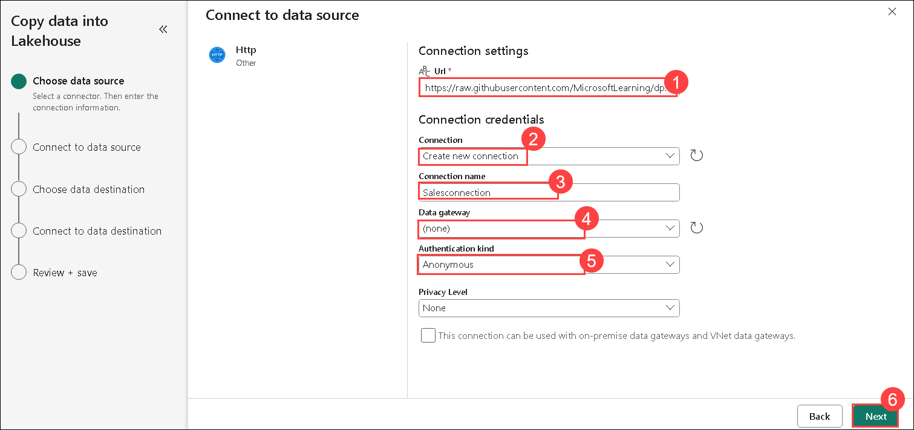

1. Then ensure the following settings are selected and then click on **Next**:

    - **Relative URL**: *Leave blank*
    - **Request method**: GET
    - **Additional headers**: *Leave blank*
    - **Binary copy**: <u>Un</u>selected
    - **Request timeout**: *Leave blank*
    - **Max concurrent connections**: *Leave blank*

1. Wait for the data to be sampled and then ensure that the following settings are selected:

    - **File format**: DelimitedText **(1)**
    - **Column delimiter**: Comma (,) **(2)**
    - **Row delimiter**: Line feed (\n) **(3)**
    - **First row as header**: Selected **(4)**
    - **Compression type**: None **(5)**

      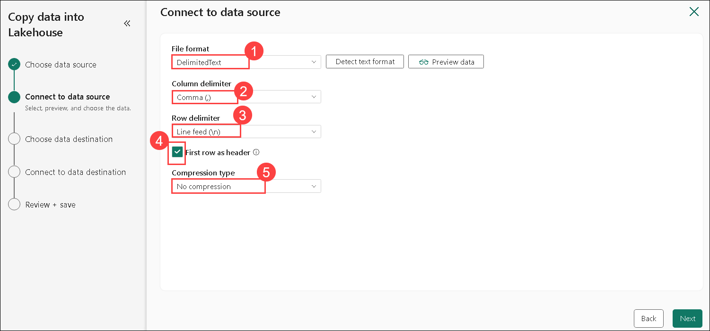    

1. Select **Preview data** to see a sample of the data that will be ingested.

    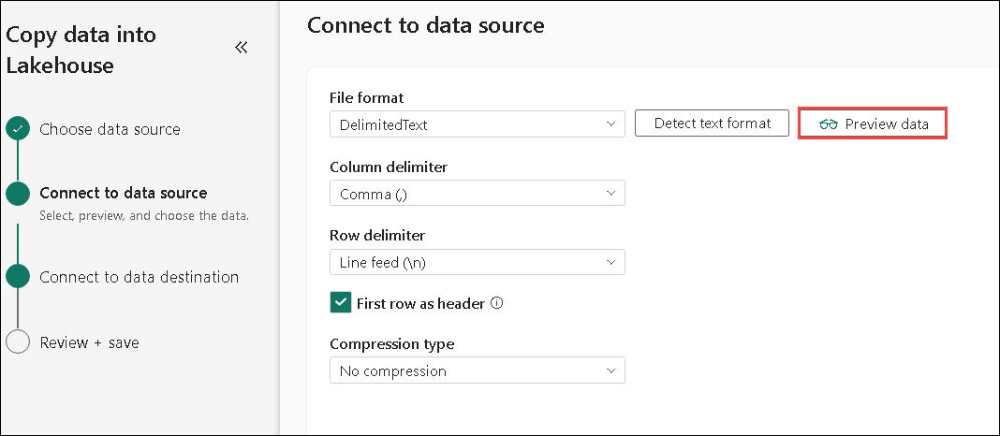

1. Then close the data preview and select **Next**.    

1. On the **Connect to data destination** page, set the following data destination options, and then select **Next (5)**:

    - **Root folder**: Files **(1)**
    - **Folder path**: new_data **(2)**
    - **File name**: sales.csv **(3)**
    - **Copy behavior**: None **(4)**

      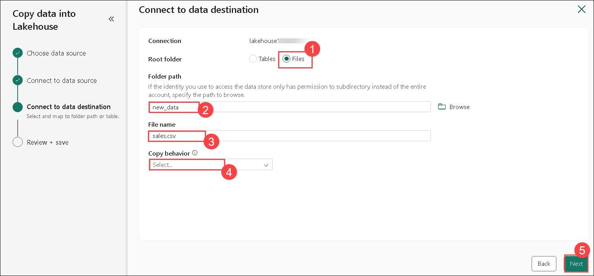     

1. Set the following file format options and then select **Next (6)**:

    - **File format**: DelimitedText **(1)**
    - **Column delimiter**: Comma (,) **(2)**
    - **Row delimiter**: Line feed (\n) **(3)**
    - **Add header to file**: Selected **(4)**
    - **Compression type**: None **(5)**

      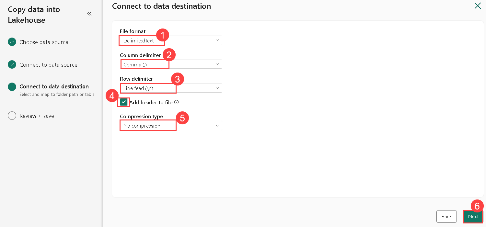 

1. On the **Copy summary** page, review the details of your copy operation and then select **Save + Run**.

1. A new pipeline containing a **Copy Data** activity is created, as shown here:

    

1. When the pipeline starts to run, you can monitor its status in the **Output** pane under the pipeline designer. Use the **&#8635;** (*Refresh*) icon **(1)** to refresh the status, and wait until it has succeeeded **(2)**.

    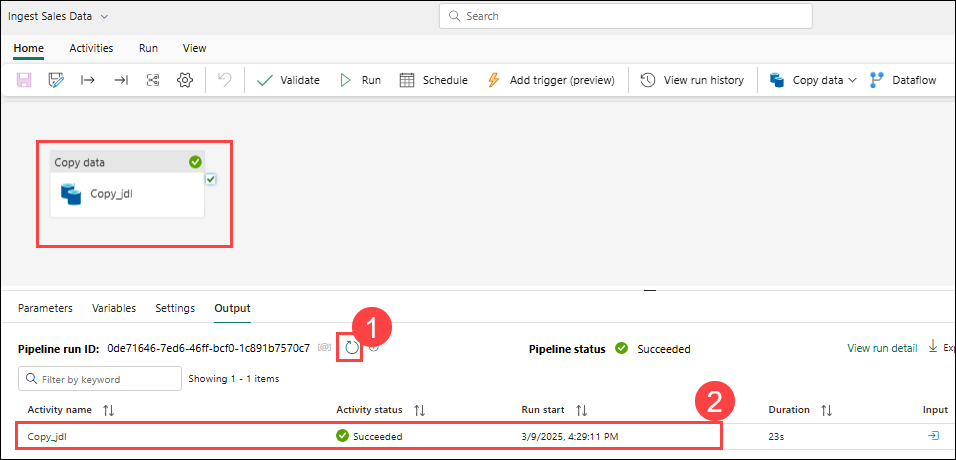

1. In the menu bar on the left, select your lakehouse.

1. On the **Home** page, in the **Lakehouse explorer** pane, expand **Files** and select the **new_data (1)** folder to verify that the **sales.csv (2)** file has been copied.

    

### Task 3: Create a notebook

In this task, you will create a notebook in Microsoft Fabric to begin processing your ingested data using PySpark. You’ll write code to load sales data, apply transformations, and save the results as a table in the lakehouse—enabling further analysis or reporting through SQL or visualization tools.

1. On the **Home** page for your lakehouse, in the **Open notebook (1)** menu, select **New notebook (2)**.

    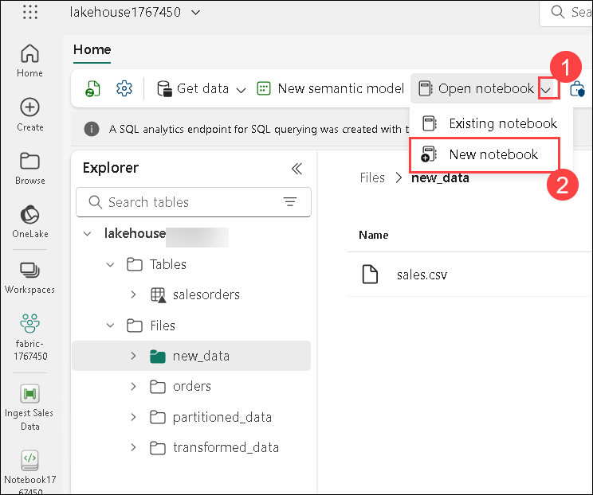

     >**Note**: After a few seconds, a new notebook containing a single *cell* will open. Notebooks are made up of one or more cells that can contain *code* or *markdown* (formatted text).

2. Select the existing cell in the notebook, which contains some simple code, and then replace the default code with the following variable declaration.

    ```python
   table_name = "sales"
    ```

3. In the **... (1)** menu for the cell (at its top-right) select **Toggle parameter cell (2)**. This configures the cell so that the variables declared in it are treated as parameters when running the notebook from a pipeline.

    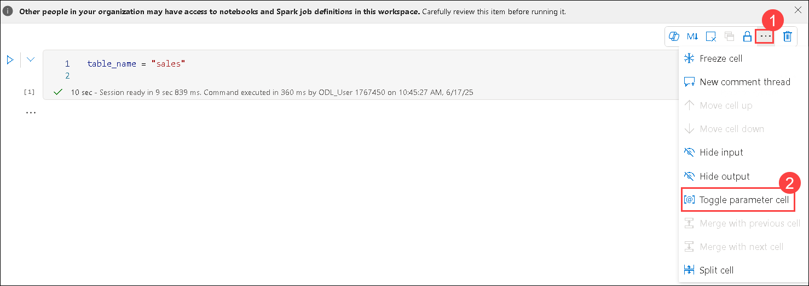

4. Under the parameters cell, use the **+ Code** button to add a new code cell. Then add the following code to it:

    ```python
   from pyspark.sql.functions import *

   # Read the new sales data
   df = spark.read.format("csv").option("header","true").load("Files/new_data/*.csv")

   ## Add month and year columns
   df = df.withColumn("Year", year(col("OrderDate"))).withColumn("Month", month(col("OrderDate")))

   # Derive FirstName and LastName columns
   df = df.withColumn("FirstName", split(col("CustomerName"), " ").getItem(0)).withColumn("LastName", split(col("CustomerName"), " ").getItem(1))

   # Filter and reorder columns
   df = df["SalesOrderNumber", "SalesOrderLineNumber", "OrderDate", "Year", "Month", "FirstName", "LastName", "EmailAddress", "Item", "Quantity", "UnitPrice", "TaxAmount"]

   # Load the data into a table
   df.write.format("delta").mode("append").saveAsTable(table_name)
    ```

    This code loads the data from the sales.csv file that was ingested by the **Copy Data** activity, applies some transformation logic, and saves the transformed data as a table - appending the data if the table already exists.

5. Verify that your notebooks looks similar to this, and then use the **&#9655; Run all** button on the toolbar to run all of the cells it contains.

    

    > **Note**: Since this is the first time you've run any Spark code in this session, the Spark pool must be started. This means that the first cell can take a minute or so to complete.

6. When the notebook run has completed, in the **Lakehouse explorer** pane on the left, in the **...** menu for **Tables** select **Refresh** and verify that a **sales** table has been created.

    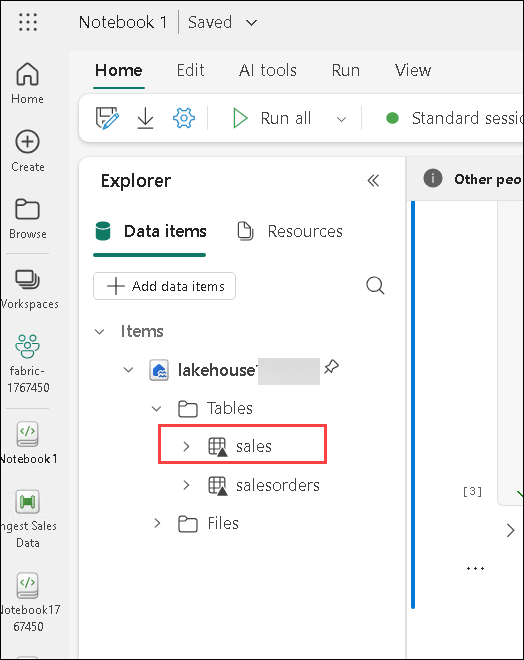

7. In the notebook menu bar, use the ⚙️ **Settings** icon to view the notebook settings.

    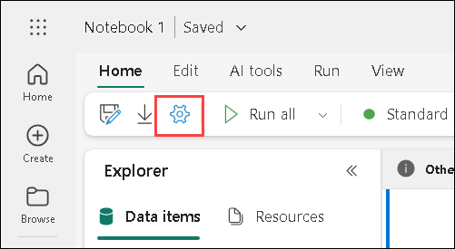

8. Then set the **Name** of the notebook to **Load Sales (1)** and close the settings pane **(2)**.

    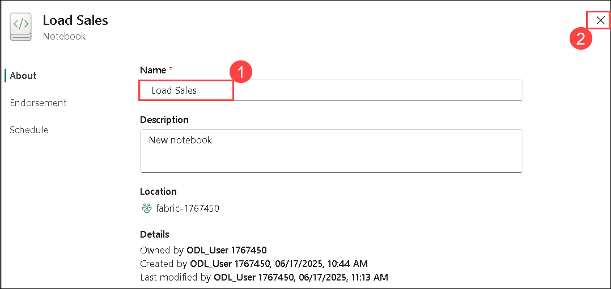

9. In the hub menu bar on the left, select your lakehouse.

    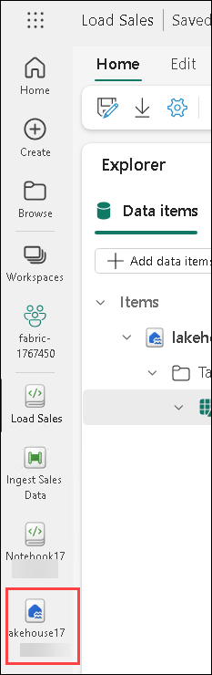

10. In the **Explorer** pane, refresh the view. Then expand **Tables**, and select the **sales** table to see a preview of the data it contains.

### Task 4: Modify the pipeline

In this task, you will modify your existing pipeline to include the notebook you created for data transformation. By integrating the notebook into the pipeline, you’ll build a reusable and automated ETL process that extracts data, runs Spark-based transformations, and loads the results into a lakehouse table.

1. In the hub menu bar on the left select the **Ingest Sales Data** pipeline you created previously.

    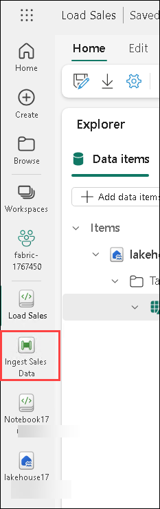

1. On the **Activities (1)** tab, click on the elipses **(...) (2)** list, select **Delete data (3)**. 

    

1. Then position the new **Delete data**  activity to the left of the **Copy data** activity and connect its **On completion** output to the **Copy data** activity, as shown here:    

    

1. Select the **Delete data** activity, and in the pane below the design canvas, set the following properties:
    - **General**:
        - **Name**: Delete old files
    - **Source (1)**
        - **Connection**: **lakehouse<inject key="DeploymentID" enableCopy="false"/> (2)**
        - **File path type**: Wildcard file path **(3)**
        - **Folder path**: Files / **new_data** **(4)**
        - **Wildcard file name**: *.csv **(5)**       
        - **Recursively**: *Selected* **(6)**

          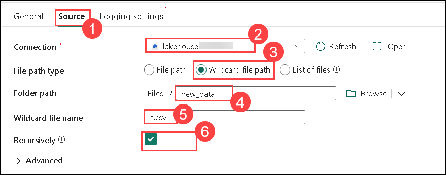

    - **Logging settings (1)**:
        - **Enable logging**: *<u>Un</u>selected* **(2)**

          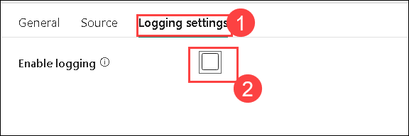        

1. These settings will ensure that any existing .csv files are deleted before copying the **sales.csv** file.

1. In the pipeline designer, on the **Activities (1)** tab, select **Notebook (2)** to add a **Notebook** activity to the pipeline.

    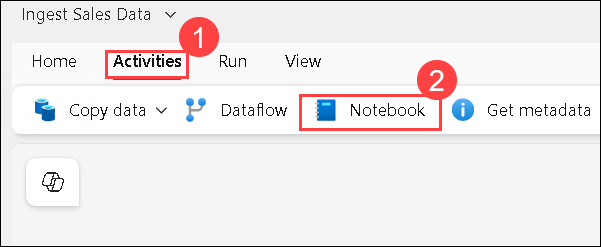

1. Select the **Copy data** activity and then connect its **On Completion** output to the **Notebook** activity as shown here:

    

1. Select the **Notebook (1)** activity, and then in the pane below the design canvas, set the following properties:
    - **General (2)**:
        - **Name**: Load Sales notebook **(3)**

      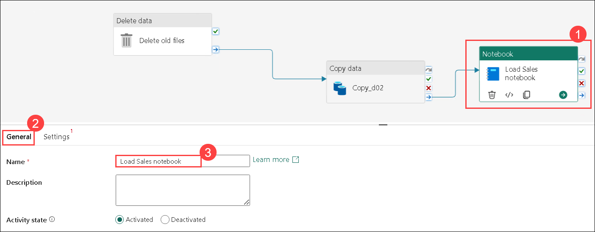

    - **Settings (1)**:
        - **Notebook**: Load Sales **(2)**
        - **Base parameters (3)**: *Add a new parameter **(4)** with the following properties:*
            
            | Name | Type | Value |
            | -- | -- | -- |
            | table_name **(5)** | String **(6)** | new_sales **(7)** |

            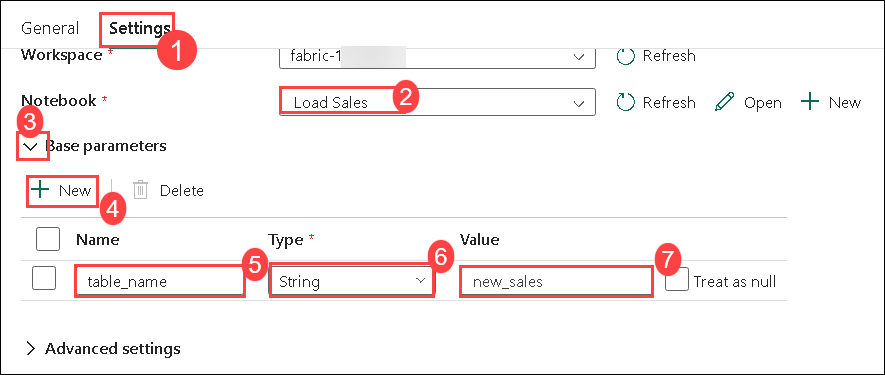            

    The **table_name** parameter will be passed to the notebook and override the default value assigned to the **table_name** variable in the parameters cell.

1. On the **Home** tab, use the **&#128427;** (*Save*) icon to save the pipeline. Then use the **&#9655; Run** button to run the pipeline.

    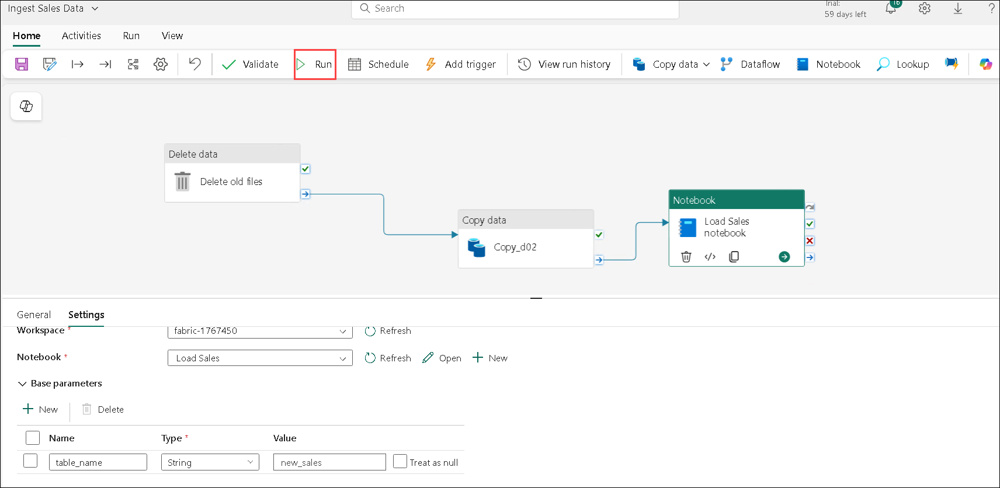

1. Click on **Refresh (1)**, untill all of the activities are succeeded **(2)**.  

    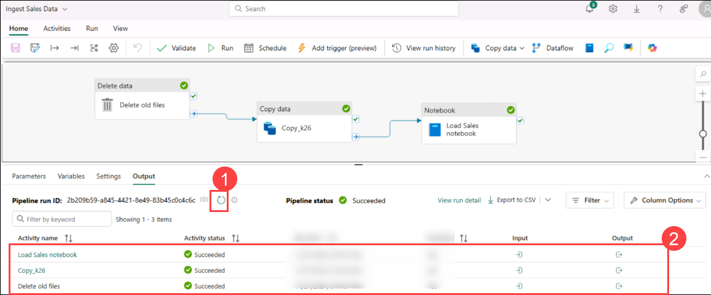

     >**Note**: In case you receive the error message *Spark SQL queries are only possible in the context of a lakehouse. Please attach a lakehouse to proceed*: Open your notebook, select the lakehouse you created on the left pane, select **Remove all Lakehouses** and then add it again. Go back to the pipeline designer and select **&#9655; Run**.

1. In the hub menu bar on the left edge of the portal, select your lakehouse.

1. In the **Explorer** pane, expand **Tables** and select the **new_sales** table to see a preview of the data it contains. This table was created by the notebook when it was run by the pipeline.

    

### Review    

In this lab, you implemented a data ingestion solution that uses a pipeline to copy data to your lakehouse from an external source, and then uses a Spark notebook to transform the data and load it into a table.

In this lab, you have completed the following tasks:

- Created a Subfolder in lakehouse
- Created a pipeline
- Created a notebook
- Modified the pipeline

## Now, click on Next from the lower right corner to move on to the next lab.
