# Lab 3: Create and use Dataflows (Gen2) in Microsoft Fabric

## Estimated Duration: 30 minutes

In this lab, you will learn how to create and use Dataflows (Gen2) in Microsoft Fabric to connect to various data sources and perform data transformations using Power Query Online. You will also see how Dataflows (Gen2) can be used in Data Pipelines to ingest data into a lakehouse or define datasets for Power BI reports. 

This lab is designed to introduce the different elements of Dataflows (Gen2), and not create a complex solution that may exist in an enterprise.

## Lab Objectives

In this lab, you will be able to complete the following tasks:

- Task 1: Create a Dataflow (Gen2) to ingest data
- Task 2: Add data destination for Dataflow
- Task 3: Add a dataflow to a pipeline

### Task 1: Create a Dataflow (Gen2) to ingest data

In this task, you will create a Dataflow (Gen2) in Microsoft Fabric to ingest data into your lakehouse. You'll define an extract, transform, and load (ETL) process using Power Query Online, enabling you to connect to a source dataset, apply data transformations, and load the clean data into your analytical storage for further use.

1. In the home page for your workspace, select **New item (1)** > **Dataflow Gen2 (2)**. After a few seconds, the Power Query editor for your new dataflow opens as shown here.

   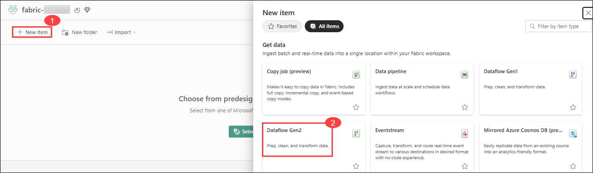

   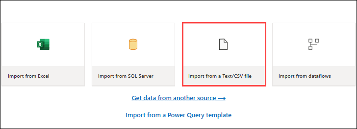

2. Select **Import from a Text/CSV file**, and create a new data source with the following settings:

    - **Link to file**: *Selected* (1)
    - **File path or URL**: `https://raw.githubusercontent.com/MicrosoftLearning/dp-data/main/orders.csv` (2)
    - **Connection**: Create new connection (3)
    - **data gateway**: (none) (4)
    - **Authentication kind**: Anonymous (5)

3. Select **Next (6)** to preview the file data, and then **Create (7)** the data source. The Power Query editor shows the data source and an initial set of query steps to format the data, as shown here:

   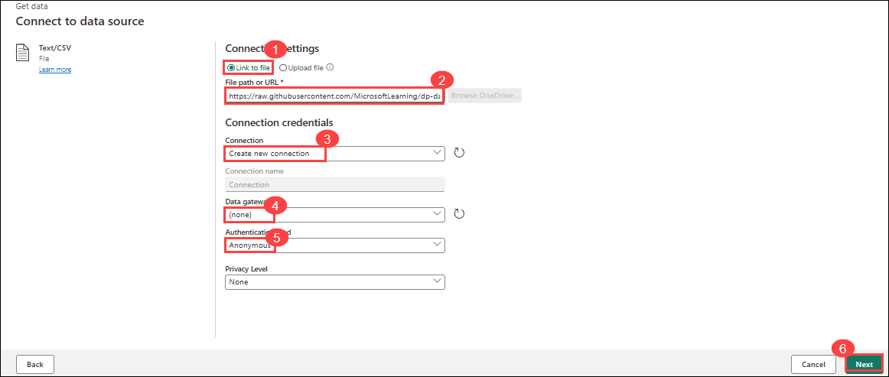

   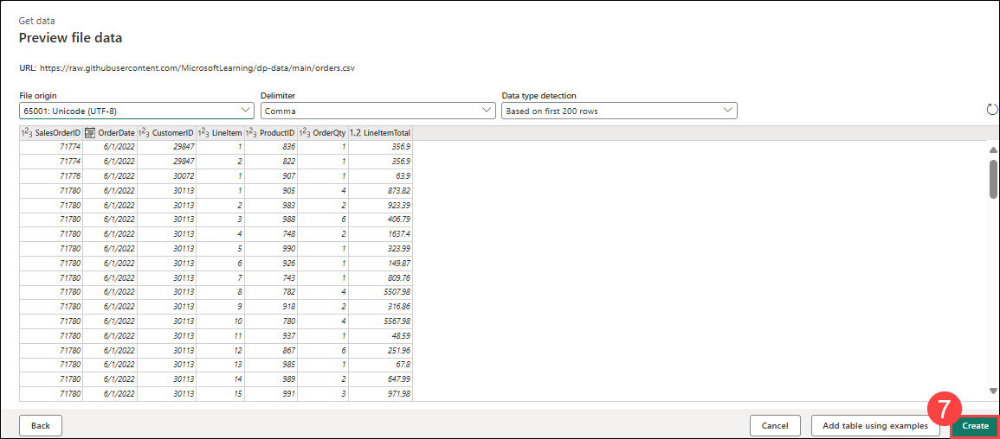

4. On the toolbar ribbon, select the **Add column (1)** tab. Then select **Custom column (2)** and create a new column.

5. Set the *New column name* to  `MonthNo` (3) , set the *Data type* to **Whole Number (4)** and then add the following formula: `Date.Month([OrderDate])` (5) - as shown here:

   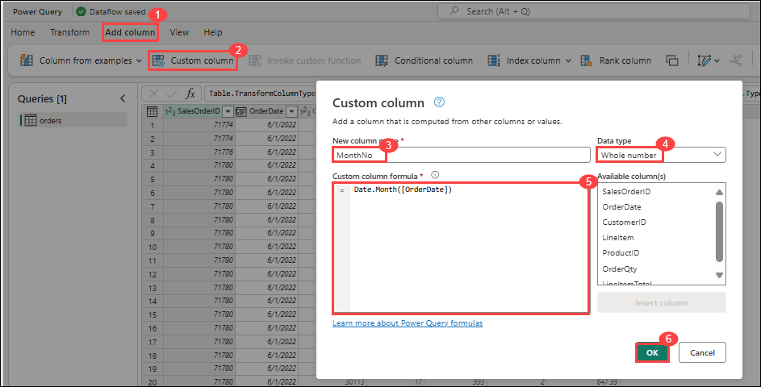

6. Select **OK (6)** to create the column and notice how the step to add the custom column is added to the query. The resulting column is displayed in the data pane:

   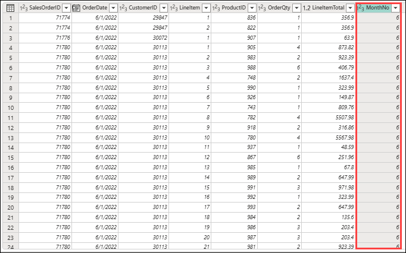

   >**Tip:** In the Query Settings pane on the right side, notice the **Applied Steps** include each transformation step. At the bottom, you can also toggle the **Diagram flow** button to turn on the Visual Diagram of the steps.

   >**Note**: Steps can be moved up or down, edited by selecting the gear icon, and you can select each step to see the transformations apply in the preview pane.

7. Check and confirm that the data type for the **OrderDate** column is set to **Date** and the data type for the  newly created column **MonthNo** is set to **Whole Number**.

### Task 2: Add data destination for Dataflow

In this task, you will configure the destination for your Dataflow (Gen2) so the transformed data is loaded into your Microsoft Fabric lakehouse. You'll connect the dataflow to your lakehouse, define a new table named orders, and adjust destination settings to ensure the data is appended appropriately.

1. On the toolbar ribbon, select the **Home (1)** tab. Then in the **Add data destination (2)** drop-down menu, select **Lakehouse (3)**.

   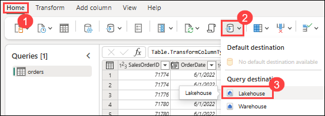

   >**Note:** If this option is grayed out, you may already have a data destination set. Check the data destination at the bottom of the Query settings pane on the right side of the Power Query editor. If a destination is already set, you can change it using the gear.

2. In the **Connect to data destination** dialog box, edit the connection and sign in using your Power BI organizational account (Only If required) to set the identity that the dataflow uses to access the lakehouse.

   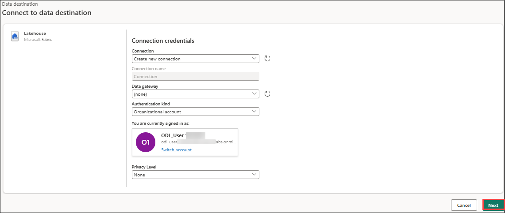

3. Select **Next** and in the list of available workspaces, find your workspace and select the **lakehouse (1)** you created in it at the start of this exercise. Then specify a new table named **orders (2)**:

   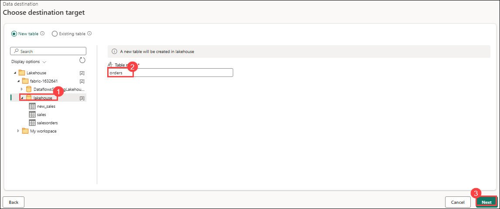

4. Select **Next (3)** and on the **Choose destination settings** page, disable the **Use automatic settings (1)** option, select **Append (2)** and then **Save settings (3)**.

   >**Note:** We suggest using the *Power query* editor for updating data types, but you can also do so from this page, if you prefer.

    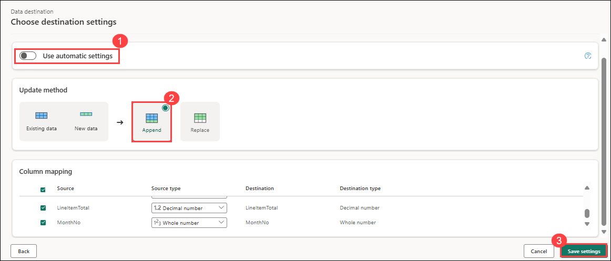

5. On the Menu bar, open **View** and select **Diagram view**. Notice the **Lakehouse (1)** destination is indicated as an icon in the query in the Power Query editor.

   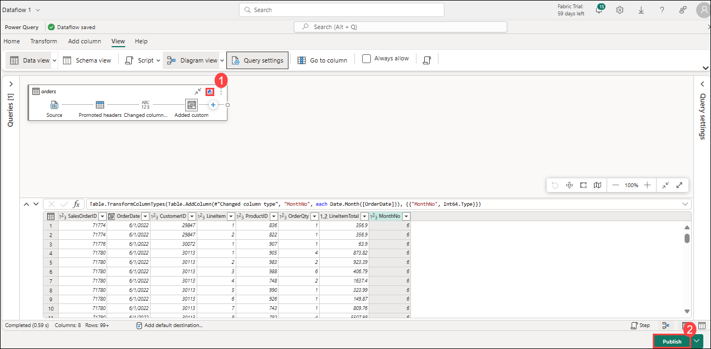

6. Select **Publish (2)** to publish the dataflow. Then wait for the **Dataflow 1** dataflow to be created in your workspace.

### Task 3: Add a dataflow to a pipeline

In this task, you will add your Dataflow (Gen2) as an activity within a pipeline. This allows you to orchestrate the dataflow alongside other data operations in a unified and repeatable workflow using the Data Factory experience in Microsoft Fabric.

1. From your Fabric-enabled workspace, make sure you're still in the **Data Engineering** experience. Select **+ New item** > **Data pipeline**, then when prompted, create a new pipeline named **Load data** and the pipeline editor open up

   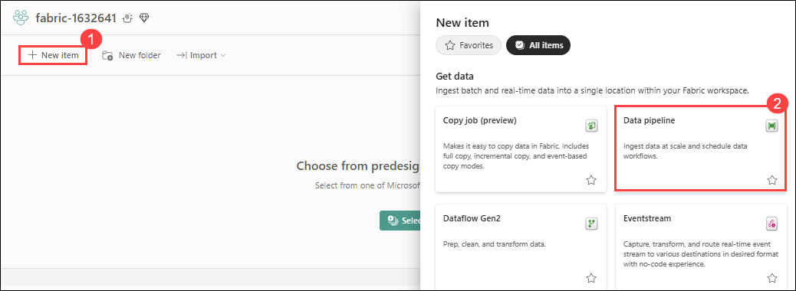

   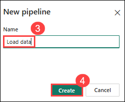

   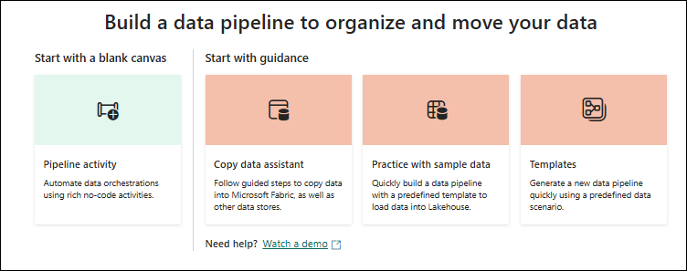

   > **Tip**: If the Copy Data wizard opens automatically, close it!

2. Select **Add pipeline activity (1)**, and add a **Dataflow (2)** activity to the pipeline.

   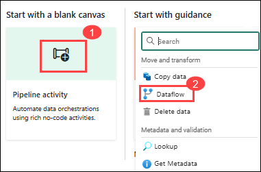

3. With the new **Dataflow1** activity selected, on the **Settings (1)** tab, in the **Dataflow** drop-down list, select **Dataflow 1 (2)** (the data flow you created previously)

   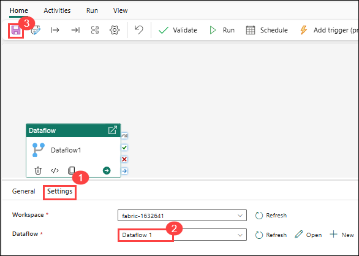

4. On the **Home** tab, save the pipeline using the **&#128427;** (*Save*) icon.

5. Use the **&#9655; Run** button to run the pipeline, and wait for it to complete. It may take a few minutes.

6. In the menu bar on the left edge, select your lakehouse.

7. In the **...** menu for **Tables**, select **refresh**. Then expand **Tables** and select the **orders** table, which has been created by your dataflow.

   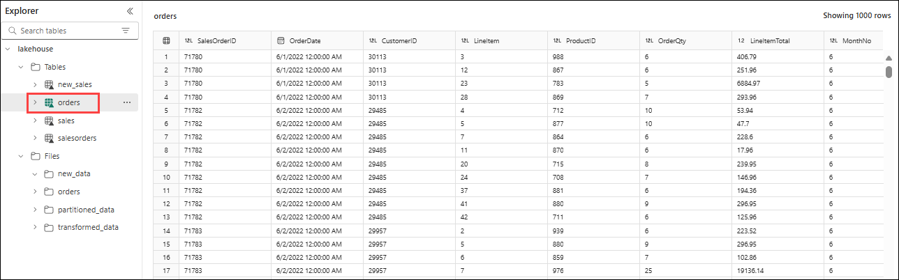

> **Tip**: In Power BI Desktop, you can connect directly to the data transformations done with your dataflow by using the *Power BI dataflows (Legacy)* connector.
> **Note**: You can also make additional transformations, publish as a new dataset, and distribute with intended audience for specialized datasets.

## Review
This lab provided a hands-on introduction to working with Dataflows (Gen2) in Microsoft Fabric. You learned how to create a dataflow to ingest data, configure a lakehouse as the destination, and integrate the dataflow into a pipeline for orchestration. These foundational tasks demonstrate how to build scalable and repeatable data ingestion processes within the Fabric ecosystem.

In this lab, you have completed the following tasks:
- Created a Dataflow (Gen2) to ingest data
- Added data destination for Dataflow
- Added a dataflow to a pipeline 

## You have successfully completed the lab.

