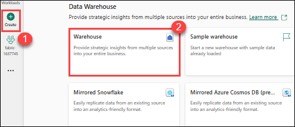
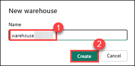
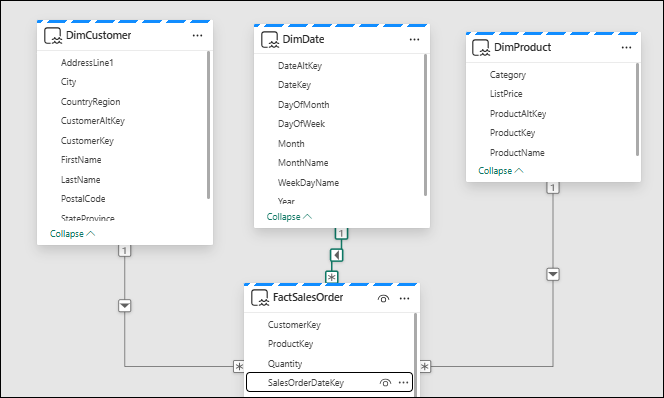
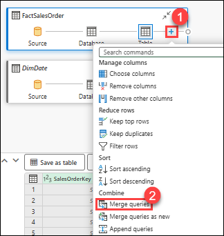
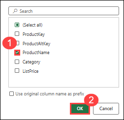
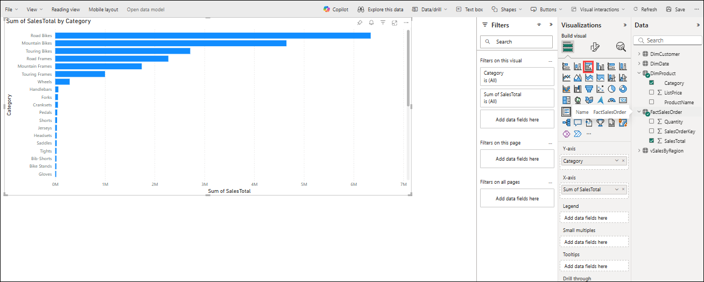
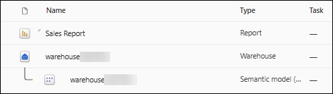

# Lab 1:  Analyze data in a data warehouse

## Estimated duration: 30 minutes

In Microsoft Fabric, a data warehouse provides a relational database for large-scale analytics. Unlike the default read-only SQL endpoint for tables defined in a lakehouse, a data warehouse provides full SQL semantics; including the ability to insert, update, and delete data in the tables.

In this hands-on lab, you will learn how to create a data warehouse in Microsoft Fabric, define tables, build a relational data model, query data, and visualize results through reports. You will experience how a fully functional data warehouse enables large-scale analytics by offering full SQL semantics for inserting, updating, and deleting data.

## Lab Objectives

In this lab, you will be able to complete the following tasks:

- Task 1: Create a data warehouse
- Task 2: Create tables and insert data
- Task 3: Define a data model
- Task 4: Query data warehouse tables
- Task 5: Create a view
- Task 6: Create a visual query
- Task 7: Visualize your data

### Task 1: Create a data warehouse

In this task, you will create a new data warehouse in your Microsoft Fabric workspace. This will serve as the foundation for your analytics solution.

1. On the menu bar on the left, select **Create**. In the *New* page, under the *Data Warehouse* section, select **Warehouse**. Give it a unique name of your choice.

    

    

    >**Note**: If the **Create** option is not pinned to the sidebar, you need to select the ellipsis (**...**) option first.

    After a minute or so, a new warehouse will be created:

    

### Task 2: Create tables and insert data

In this task, you will create tables inside your data warehouse and populate them with sample data.

1. In your new warehouse, select the **T-SQL** tile, and use the following CREATE TABLE statement:

    ```sql
   CREATE TABLE dbo.DimProduct
   (
       ProductKey INTEGER NOT NULL,
       ProductAltKey VARCHAR(25) NULL,
       ProductName VARCHAR(50) NOT NULL,
       Category VARCHAR(50) NULL,
       ListPrice DECIMAL(5,2) NULL
   );
   GO
    ```

2. Use the **&#9655; Run** button to run the SQL script, which creates a new table named **DimProduct** in the **dbo** schema of the data warehouse.
3. Use the **Refresh** button on the toolbar to refresh the view. Then, in the **Explorer** pane, expand **Schemas** > **dbo** > **Tables** and verify that the **DimProduct** table has been created.
4. On the **Home** menu tab, use the **New SQL Query** button to create a new query, and enter the following INSERT statement:

    ```sql
   INSERT INTO dbo.DimProduct
   VALUES
   (1, 'RING1', 'Bicycle bell', 'Accessories', 5.99),
   (2, 'BRITE1', 'Front light', 'Accessories', 15.49),
   (3, 'BRITE2', 'Rear light', 'Accessories', 15.49);
   GO
    ```

5. Run the new query to insert three rows into the **DimProduct** table.
6. When the query has finished, in the **Explorer** pane, select the **DimProduct** table and verify that the three rows have been added to the table.
7. On the **Home** menu tab, use the **New SQL Query** button to create a new query. Then copy and paste the Transact-SQL code from `https://raw.githubusercontent.com/MicrosoftLearning/dp-data/main/create-dw.txt` into the new query pane.
8. Run the query, which creates a simple data warehouse schema and loads some data. The script should take around 30 seconds to run.
9. Use the **Refresh** button on the toolbar to refresh the view. Then in the **Explorer** pane, verify that the **dbo** schema in the data warehouse now contains the following four tables:
    - **DimCustomer**
    - **DimDate**
    - **DimProduct**
    - **FactSalesOrder**

    > **Tip**: If the schema takes a while to load, just refresh the browser page.

### Task 3: Define a data model

A relational data warehouse typically consists of *fact* and *dimension* tables. The fact tables contain numeric measures you can aggregate to analyze business performance (for example, sales revenue), and the dimension tables contain attributes of the entities by which you can aggregate the data (for example, product, customer, or time). In a Microsoft Fabric data warehouse, you can use these keys to define a data model that encapsulates the relationships between the tables.

In this task, you will establish relationships between tables to create a star schema data model, improving query efficiency and enabling meaningful insights.

1. In the toolbar, select the **Model layouts** button.
2. In the model pane, rearrange the tables in your data warehouse so that the **FactSalesOrder** table is in the middle, like this:

    

> **Note**: The views **frequently_run_queries**, **long_running_queries**, **exec_sessions_history**, and **exec_requests_history** are part of the **queryinsights** schema automatically created by Fabric. It is a feature that provides a holistic view of historical query activity on the SQL analytics endpoint. Since this feature is out of the scope of this exercise, those views should be ignored for now.

3. Drag the **ProductKey** field from the **FactSalesOrder** table and drop it on the **ProductKey** field in the **DimProduct** table. Then confirm the following relationship details:
    - **From table**: FactSalesOrder
    - **Column**: ProductKey
    - **To table**: DimProduct
    - **Column**: ProductKey
    - **Cardinality**: Many to one (*:1)
    - **Cross filter direction**: Single
    - **Make this relationship active**: Selected
    - **Assume referential integrity**: Unselected

4. Repeat the process to create many-to-one relationships between the following tables:
    - **FactSalesOrder.CustomerKey** &#8594; **DimCustomer.CustomerKey**
    - **FactSalesOrder.SalesOrderDateKey** &#8594; **DimDate.DateKey**

    When all of the relationships have been defined, the model should look like this:

    

### Task 4: Query data warehouse tables

In this task, you will write and execute SQL queries to retrieve and aggregate data from the data warehouse.

#### Query fact and dimension tables

Most queries in a relational data warehouse involve aggregating and grouping data (using aggregate functions and GROUP BY clauses) across related tables (using JOIN clauses).

1. Create a new SQL Query, and run the following code:

    ```sql
   SELECT  d.[Year] AS CalendarYear,
            d.[Month] AS MonthOfYear,
            d.MonthName AS MonthName,
           SUM(so.SalesTotal) AS SalesRevenue
   FROM FactSalesOrder AS so
   JOIN DimDate AS d ON so.SalesOrderDateKey = d.DateKey
   GROUP BY d.[Year], d.[Month], d.MonthName
   ORDER BY CalendarYear, MonthOfYear;
    ```

    Note that the attributes in the date dimension enable you to aggregate the measures in the fact table at multiple hierarchical levels - in this case, year and month. This is a common pattern in data warehouses.

2. Modify the query as follows to add a second dimension to the aggregation.

    ```sql
   SELECT  d.[Year] AS CalendarYear,
           d.[Month] AS MonthOfYear,
           d.MonthName AS MonthName,
           c.CountryRegion AS SalesRegion,
          SUM(so.SalesTotal) AS SalesRevenue
   FROM FactSalesOrder AS so
   JOIN DimDate AS d ON so.SalesOrderDateKey = d.DateKey
   JOIN DimCustomer AS c ON so.CustomerKey = c.CustomerKey
   GROUP BY d.[Year], d.[Month], d.MonthName, c.CountryRegion
   ORDER BY CalendarYear, MonthOfYear, SalesRegion;
    ```

3. Run the modified query and review the results, which now include sales revenue aggregated by year, month, and sales region.

### Task 5: Create a view

A data warehouse in Microsoft Fabric has many of the same capabilities you may be used to in relational databases. For example, you can create database objects like *views* and *stored procedures* to encapsulate SQL logic.

In this task, you will encapsulate your SQL logic into a view, simplifying future querying.

1. Modify the query you created previously as follows to create a view (note that you need to remove the ORDER BY clause to create a view).

    ```sql
   CREATE VIEW vSalesByRegion
   AS
   SELECT  d.[Year] AS CalendarYear,
           d.[Month] AS MonthOfYear,
           d.MonthName AS MonthName,
           c.CountryRegion AS SalesRegion,
          SUM(so.SalesTotal) AS SalesRevenue
   FROM FactSalesOrder AS so
   JOIN DimDate AS d ON so.SalesOrderDateKey = d.DateKey
   JOIN DimCustomer AS c ON so.CustomerKey = c.CustomerKey
   GROUP BY d.[Year], d.[Month], d.MonthName, c.CountryRegion;
    ```

2. Run the query to create the view. Then refresh the data warehouse schema and verify that the new view is listed in the **Explorer** pane.
3. Create a new SQL query and run the following SELECT statement:

    ```SQL
   SELECT CalendarYear, MonthName, SalesRegion, SalesRevenue
   FROM vSalesByRegion
   ORDER BY CalendarYear, MonthOfYear, SalesRegion;
    ```

### Task 6: Create a visual query

Instead of writing SQL code, you can use the graphical query designer to query the tables in your data warehouse. This experience is similar to Power Query online, where you can create data transformation steps with no code. For more complex tasks, you can use Power Query's M (Mashup) language.

In this task, you will use the visual query designer to build queries graphically, without writing SQL code.

1. On the **Home** menu, expand the options under **New SQL query** and select **New visual query**.

1. Drag **FactSalesOrder** onto the **canvas**. Notice that a preview of the table is displayed in the **Preview** pane below.

1. Drag **DimProduct** onto the **canvas**. We now have two tables in our query.

1. Use the **(+)** button on the **FactSalesOrder** table on the canvas to **Merge queries (2)**.

   

1. In the **Merge queries** window, select **DimProduct** as the right table for merge. Select **ProductKey** in both queries, leave the default **Left outer** join type, and click **OK**.

2. In the **Preview**, note that the new **DimProduct** column has been added to the FactSalesOrder table. Expand the column by clicking the arrow to the right of the column name. Select **ProductName (1)** and click **OK (2)**.

    

1. If you're interested in looking at data for a single product, per a manager request, you can now use the **ProductName** column to filter the data in the query. Filter the **ProductName** column to look at **Cable Lock** data only.

1. From here, you can analyze the results of this single query by selecting **Visualize results** or **Download Excel file**. You can now see exactly what the manager was asking for, so we don't need to analyze the results further.

### Task 7: Visualize your data

You can easily visualize the data in either a single query, or in your data warehouse. Before you visualize, hide columns and/or tables that aren't friendly to report designers.

In this task, you will build a Power BI report based on the data warehouse you created.

1. Select the **Model layouts** button. 

1. Hide the following columns in your Fact and Dimension tables that are not necessary to create a report. Note that this does not remove the columns from the model, it simply hides them from view on the report canvas.
   1. FactSalesOrder
      - **SalesOrderDateKey**
      - **CustomerKey**
      - **ProductKey**
   1. DimCustomer
      - **CustomerKey**
      - **CustomerAltKey**
   1. DimDate
      - **DateKey**
      - **DateAltKey**
   1. DimProduct
      - **ProductKey**
      - **ProductAltKey** 

1. Now you're ready to build a report and make this dataset available to others. On the Reporting menu, select **New report**. This will open a new window, where you can create a Power BI report.

1. In the **Data** pane, expand **FactSalesOrder**. Note that the columns you hid are no longer visible. 

1. Select **SalesTotal**. This will add the column to the **Report canvas**. Because the column is a numeric value, the default visual is a **column chart**.
1. Ensure that the column chart on the canvas is active (with a gray border and handles), and then select **Category** from the **DimProduct** table to add a category to your column chart.
1. In the **Visualizations** pane, change the chart type from a column chart to a **clustered bar chart**. Then resize the chart as necessary to ensure that the categories are readable.

    

1. In the **Visualizations** pane, select the **Format your visual** tab and in the **General** sub-tab, in the **Title** section, change the **Text** to **Total Sales by Category**.

1. In the **File** menu, select **Save**. Then save the report as **Sales Report** in the workspace you created previously.

1. In the menu hub on the left, navigate back to the workspace. Notice that you now have three items saved in your workspace: your data warehouse, its default semantic model, and the report you created.

    

### Review    

In this lab, you learned how to:

- Create and configure a Microsoft Fabric data warehouse.
- Define relational tables and load data using SQL.
- Build a semantic model with relationships.
- Query and aggregate data using SQL and visual interfaces.
- Create views to encapsulate queries.
- Visualize data and build reports for analytical insights.

## Now, click on Next from the lower right corner to move on to the next lab.
