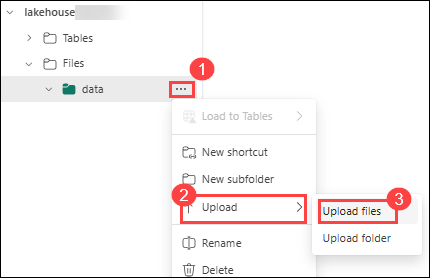
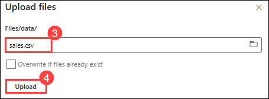
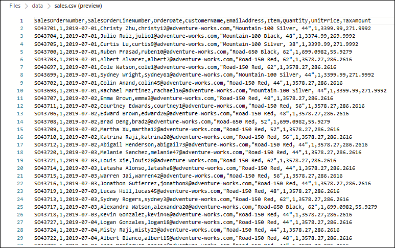
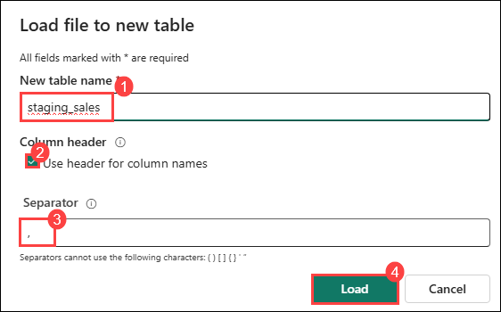
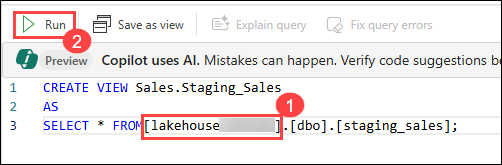

# Lab 2: Load data into a warehouse using T-SQL

## Estimated duration: 45 minutes

In Microsoft Fabric, a data warehouse provides a relational database for large-scale analytics. Unlike the default read-only SQL endpoint for tables defined in a lakehouse, a data warehouse provides full SQL semantics; including the ability to insert, update, and delete data in the tables.

In this hands-on lab, you will learn how to load data into a Microsoft Fabric data warehouse using T-SQL. You will first create a lakehouse, upload files, and create tables in the lakehouse. Then, you will create a data warehouse, define fact and dimension tables, and load data into the warehouse using T-SQL stored procedures. Finally, you will perform analytical queries to validate the data.

## Lab Objectives

In this lab, you will complete the following tasks:

- Task 1: Create a lakehouse
- Task 2: Upload a file
- Task 3: Create a table in the lakehouse
- Task 4: Create a warehouse
- Task 5: Create fact table, dimensions and view
- Task 6: Load data to the warehouse
- Task 7: Run analytical queries

### Task 1: Create a lakehouse

In this task, you will create a data lakehouse in Microsoft Fabric for storing and managing your data files.

1. Return to your workspace and click the **+ New item (1)** icon.  

2. On the **All items** page, scroll down to the **Store data** section and select **Lakehouse (2)**.  

     

3. Provide the following details to create a **Lakehouse**:  

   - **Name:** Enter **lakehouse<inject key="DeploymentID" enableCopy="false"/>**  

4. Click **Create** to proceed.  

5. View the new lakehouse, and note that the **Lakehouse explorer** pane on the left enables you to browse tables and files in the lakehouse:

    - The **Tables** folder contains tables that you can query using SQL semantics. Tables in a Microsoft Fabric lakehouse are based on the open source *Delta Lake* file format, commonly used in Apache Spark.

    - The **Files** folder contains data files in the OneLake storage for the lakehouse that aren't associated with managed delta tables. You can also create *shortcuts* in this folder to reference data that is stored externally.

   

   >**Note**: Currently, there are no tables or files in the lakehouse.

### Task 2: Upload a file

Fabric provides multiple ways to load data into the lakehouse, including built-in support for pipelines that copy data from external sources and data flows (Gen 2) that you can define using visual tools based on Power Query. However one of the simplest ways to ingest small amounts of data is to upload files or folders from your local computer.

In this task, you will upload a CSV file to the lakehouse for use in the warehouse.

1. Return to the web browser tab containing your lakehouse, and in the **... (1)** menu for the **Files** folder in the **Lakehouse explorer** pane, select **New subfolder (2)**, and create a subfolder named **data (3)**.

   

   

3. In the **... (1)** menu for the new **data** folder, select **Upload (2)** and **Upload files (3)**, and then upload the **sales.csv** (C:\LabFiles\Files\) file located in the Lab VM.

    

    

4. After the file has been uploaded, select the **Files/data** folder and verify that the **sales.csv** file has been uploaded, as shown here:

5. Select the **sales.csv** file to see a preview of its contents.

    


### Task 3: Create a table in the lakehouse

In this task, you will create a table in the lakehouse using the uploaded file.

1. In the **...** menu for the **sales.csv** file in the **Explorer** pane, select **Load to tables**, and then **New table**.

1. Provide the following information in the **Load file to new table** dialog.
    - **New table name:** staging_sales (1)
    - **Use header for columns names:** Selected (2)
    - **Separator:** , (3)

1. Select **Load (4)**.

    

### Task 4: Create a warehouse

In this task, you will create a data warehouse where you will store the fact and dimension tables.

1. On the menu bar on the left, select **Create**. In the *New* page, under the *Data Warehouse* section, select **Warehouse**. Give it a unique name of your choice.

   >**Note**: If the **Create** option is not pinned to the sidebar, you need to select the ellipsis (**...**) option first.

1. After a minute or so, a new warehouse will be created:

### Task 5: Create fact table, dimensions and view

Let's create the fact tables and dimensions for the Sales data. You'll also create a view pointing to a lakehouse, this simplifies the code in the stored procedure we'll use to load.

In this task, you will define fact tables, dimension tables, and a view to streamline the data loading process.

1. From your workspace, select the warehouse you created.

1. In the warehouse toolbar, select **New SQL query**, then copy and run the following query.

    ```sql
    CREATE SCHEMA [Sales]
    GO
        
    IF NOT EXISTS (SELECT * FROM sys.tables WHERE name='Fact_Sales' AND SCHEMA_NAME(schema_id)='Sales')
    	CREATE TABLE Sales.Fact_Sales (
    		CustomerID VARCHAR(255) NOT NULL,
    		ItemID VARCHAR(255) NOT NULL,
    		SalesOrderNumber VARCHAR(30),
    		SalesOrderLineNumber INT,
    		OrderDate DATE,
    		Quantity INT,
    		TaxAmount FLOAT,
    		UnitPrice FLOAT
    	);
    
    IF NOT EXISTS (SELECT * FROM sys.tables WHERE name='Dim_Customer' AND SCHEMA_NAME(schema_id)='Sales')
        CREATE TABLE Sales.Dim_Customer (
            CustomerID VARCHAR(255) NOT NULL,
            CustomerName VARCHAR(255) NOT NULL,
            EmailAddress VARCHAR(255) NOT NULL
        );
        
    ALTER TABLE Sales.Dim_Customer add CONSTRAINT PK_Dim_Customer PRIMARY KEY NONCLUSTERED (CustomerID) NOT ENFORCED
    GO
    
    IF NOT EXISTS (SELECT * FROM sys.tables WHERE name='Dim_Item' AND SCHEMA_NAME(schema_id)='Sales')
        CREATE TABLE Sales.Dim_Item (
            ItemID VARCHAR(255) NOT NULL,
            ItemName VARCHAR(255) NOT NULL
        );
        
    ALTER TABLE Sales.Dim_Item add CONSTRAINT PK_Dim_Item PRIMARY KEY NONCLUSTERED (ItemID) NOT ENFORCED
    GO
    ```

    > **Important:** In a data warehouse, foreign key constraints are not always necessary at the table level. While foreign key constraints can help ensure data integrity, they can also add overhead to the ETL (Extract, Transform, Load) process and slow down data loading. The decision to use foreign key constraints in a data warehouse should be based on a careful consideration of the trade-offs between data integrity and performance.

1. In the **Explorer**, navigate to **Schemas >> Sales >> Tables**. Note the *Fact_Sales*, *Dim_Customer*, and *Dim_Item* tables you just created.

1. Open a new **New SQL query** editor, then copy and run the following query after Updating **<your lakehouse name>** with the lakehouse you created.

    ```sql
    CREATE VIEW Sales.Staging_Sales
    AS
	SELECT * FROM [<your lakehouse name>].[dbo].[staging_sales];
    ```

    

1. In the **Explorer**, navigate to **Schemas >> Sales >> Views**. Note the *Staging_Sales* view you created.

### Task 6: Load data to the warehouse

Now that the fact and dimensions tables are created, let's create a stored procedure to load the data from our lakehouse into the warehouse. Because of the automatic SQL endpoint created when we create the lakehouse, you can directly access the data in your lakehouse from the warehouse using T-SQL and cross-database queries.

In this task, you will load data from the lakehouse into the warehouse by creating a stored procedure.

For the sake of simplicity in this case study, you'll use the customer name and item name as the primary keys.

1. Create a new **New SQL query** editor, then copy and run the following query.

    ```sql
    CREATE OR ALTER PROCEDURE Sales.LoadDataFromStaging (@OrderYear INT)
    AS
    BEGIN
    	-- Load data into the Customer dimension table
        INSERT INTO Sales.Dim_Customer (CustomerID, CustomerName, EmailAddress)
        SELECT DISTINCT CustomerName, CustomerName, EmailAddress
        FROM [Sales].[Staging_Sales]
        WHERE YEAR(OrderDate) = @OrderYear
        AND NOT EXISTS (
            SELECT 1
            FROM Sales.Dim_Customer
            WHERE Sales.Dim_Customer.CustomerName = Sales.Staging_Sales.CustomerName
            AND Sales.Dim_Customer.EmailAddress = Sales.Staging_Sales.EmailAddress
        );
        
        -- Load data into the Item dimension table
        INSERT INTO Sales.Dim_Item (ItemID, ItemName)
        SELECT DISTINCT Item, Item
        FROM [Sales].[Staging_Sales]
        WHERE YEAR(OrderDate) = @OrderYear
        AND NOT EXISTS (
            SELECT 1
            FROM Sales.Dim_Item
            WHERE Sales.Dim_Item.ItemName = Sales.Staging_Sales.Item
        );
        
        -- Load data into the Sales fact table
        INSERT INTO Sales.Fact_Sales (CustomerID, ItemID, SalesOrderNumber, SalesOrderLineNumber, OrderDate, Quantity, TaxAmount, UnitPrice)
        SELECT CustomerName, Item, SalesOrderNumber, CAST(SalesOrderLineNumber AS INT), CAST(OrderDate AS DATE), CAST(Quantity AS INT), CAST(TaxAmount AS FLOAT), CAST(UnitPrice AS FLOAT)
        FROM [Sales].[Staging_Sales]
        WHERE YEAR(OrderDate) = @OrderYear;
    END
    ```
1. Create a new **New SQL query** editor, then copy and run the following query.

    ```sql
    EXEC Sales.LoadDataFromStaging 2021
    ```

    > **Note:** In this case, we are only loading data from the year 2021. However, you have the option to modify it to load data from previous years.

### Task 7: Run analytical queries

In this task, you will run analytical queries to validate the data loaded into the warehouse.

1. On the top menu, select **New SQL query**, then copy and run the following query.

    ```sql
    SELECT c.CustomerName, SUM(s.UnitPrice * s.Quantity) AS TotalSales
    FROM Sales.Fact_Sales s
    JOIN Sales.Dim_Customer c
    ON s.CustomerID = c.CustomerID
    WHERE YEAR(s.OrderDate) = 2021
    GROUP BY c.CustomerName
    ORDER BY TotalSales DESC;
    ```

    > **Note:** This query shows the customers by total sales for the year of 2021. The customer with the highest total sales for the specified year is **Jordan Turner**, with total sales of **14686.69**. 

1. On the top menu, select **New SQL query** or reuse the same editor, then copy and run the following query.

    ```sql
    SELECT i.ItemName, SUM(s.UnitPrice * s.Quantity) AS TotalSales
    FROM Sales.Fact_Sales s
    JOIN Sales.Dim_Item i
    ON s.ItemID = i.ItemID
    WHERE YEAR(s.OrderDate) = 2021
    GROUP BY i.ItemName
    ORDER BY TotalSales DESC;

    ```

    > **Note:** This query shows the top-seliing items by total sales for the year of 2021. These results suggest that the *Mountain-200 bike* model, in both black and silver colors, was the most popular item among customers in 2021.

1. On the top menu, select **New SQL query** or reuse the same editor, then copy and run the following query.

    ```sql
    WITH CategorizedSales AS (
    SELECT
        CASE
            WHEN i.ItemName LIKE '%Helmet%' THEN 'Helmet'
            WHEN i.ItemName LIKE '%Bike%' THEN 'Bike'
            WHEN i.ItemName LIKE '%Gloves%' THEN 'Gloves'
            ELSE 'Other'
        END AS Category,
        c.CustomerName,
        s.UnitPrice * s.Quantity AS Sales
    FROM Sales.Fact_Sales s
    JOIN Sales.Dim_Customer c
    ON s.CustomerID = c.CustomerID
    JOIN Sales.Dim_Item i
    ON s.ItemID = i.ItemID
    WHERE YEAR(s.OrderDate) = 2021
    ),
    RankedSales AS (
        SELECT
            Category,
            CustomerName,
            SUM(Sales) AS TotalSales,
            ROW_NUMBER() OVER (PARTITION BY Category ORDER BY SUM(Sales) DESC) AS SalesRank
        FROM CategorizedSales
        WHERE Category IN ('Helmet', 'Bike', 'Gloves')
        GROUP BY Category, CustomerName
    )
    SELECT Category, CustomerName, TotalSales
    FROM RankedSales
    WHERE SalesRank = 1
    ORDER BY TotalSales DESC;
    ```

    > **Note:** The results of this query show the top customer for each of the categories: Bike, Helmet, and Gloves, based on their total sales. For example, **Joan Coleman** is the top customer for the **Gloves** category.
    >
    > The category information was extracted from the `ItemName` column using string manipulation, as there is no separate category column in the dimension table. This approach assumes that the item names follow a consistent naming convention. If the item names do not follow a consistent naming convention, the results may not accurately reflect the true category of each item.

### Review  

In this exercise, you have created a lakehouse and a data warehouse with multiple tables. You have ingested data and used cross-database queries to load data from the lakehouse to the warehouse. Additionally, you have used the query tool to perform analytical queries.

In this lab, you learned how to:

- Loaded data into a Microsoft Fabric data warehouse using T-SQL.

- Created a Lakehouse to store raw data.

- Uploaded and converted a CSV file into a Lakehouse table.

- Built a warehouse schema with fact and dimension tables.

- Developed a stored procedure to automate the data loading process.

- Ran analytical queries to verify the sales data and gain insights.

## Now, click on Next from the lower right corner to move on to the next lab.
