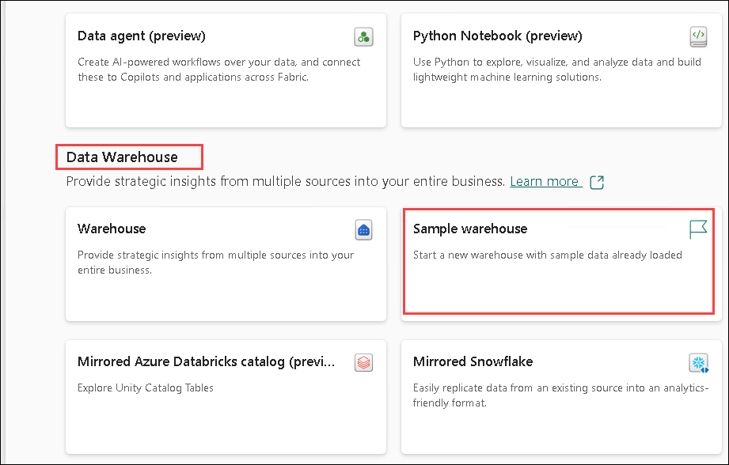
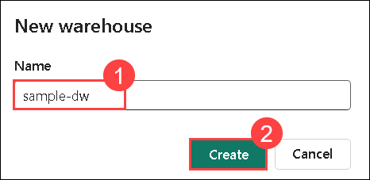
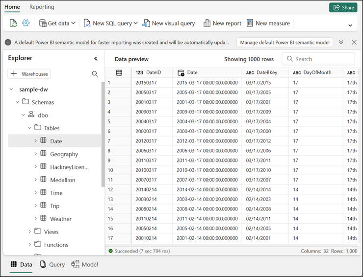
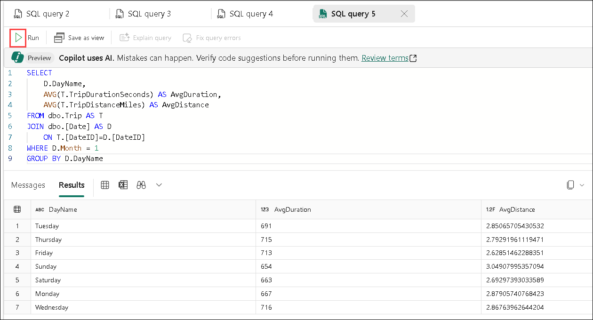
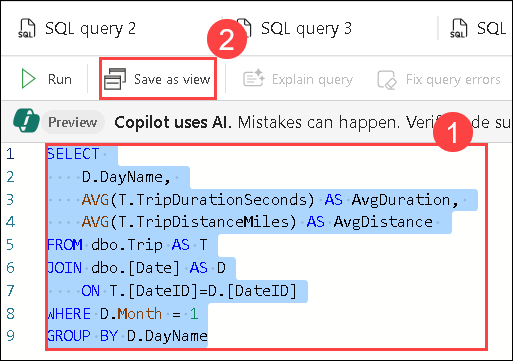
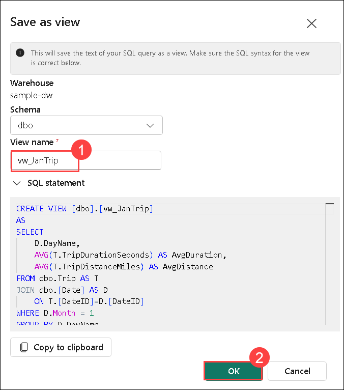
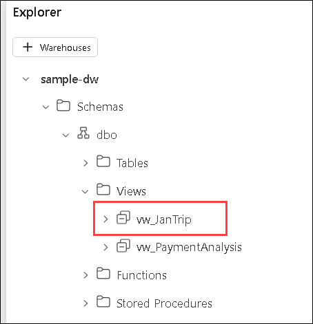

# Lab 3: Query a data warehouse in Microsoft Fabric

## Estimated duration: 45 minutes

In Microsoft Fabric, a data warehouse provides a relational database for large-scale analytics. The rich set of experiences built into Microsoft Fabric workspace enables customers to reduce their time to insights by having an easily consumable, always connected semantic model that is integrated with Power BI in DirectLake mode. 

In this hands-on lab, you will learn how to create a sample data warehouse in Microsoft Fabric, explore the data using T-SQL queries, verify the consistency of the data, and create a filtered view for reporting purposes. You will experience how the built-in SQL query editor in Microsoft Fabric can accelerate the time to insights through a connected, high-performing data environment.

## Lab Objectives

In this lab, you will complete the following tasks:

- Task 1: Create a sample data warehouse  
- Task 2: Query the data warehouse  
- Task 3: Verify data consistency  
- Task 4: Save a query as a view

### Task 1: Create a sample data warehouse

In this task, you will create a new sample data warehouse named sample-dw within your Fabric workspace, which will be populated with sample taxi ride data.

1. On the menu bar on the left, select **Create**. In the *New* page, under the **Data Warehouse** section. select **Sample warehouse**.

    

    >**Note**: If the **Create** option is not pinned to the sidebar, you need to select the ellipsis (**...**) option first.   

1. Create a new data warehouse named **sample-dw (1)** and then click **Create (2)**.

    

1. After a minute or so, a new warehouse will be created and populated with sample data for a taxi ride analysis scenario.

    

### Task 2: Query the data warehouse

The SQL query editor provides support for IntelliSense, code completion, syntax highlighting, client-side parsing, and validation. You can run Data Definition Language (DDL), Data Manipulation Language (DML) and Data Control Language (DCL) statements.

In this task, you will write and run SQL queries to analyze trip trends based on month, day, and geography, gaining insights from the warehouse data.

1. In the **sample-dw** data warehouse page, in the **New SQL query** drop-down list, select **New SQL query**.

1. In the new blank query pane, enter the following Transact-SQL code:

    ```sql
    SELECT 
    D.MonthName, 
    COUNT(*) AS TotalTrips, 
    SUM(T.TotalAmount) AS TotalRevenue 
    FROM dbo.Trip AS T
    JOIN dbo.[Date] AS D
        ON T.[DateID]=D.[DateID]
    GROUP BY D.MonthName;
    ```

1. Use the **&#9655; Run** button to run the SQL script and view the results, which show the total number of trips and total revenue by month.

    

1. Enter the following Transact-SQL code:

    ```sql
   SELECT 
    D.DayName, 
    AVG(T.TripDurationSeconds) AS AvgDuration, 
    AVG(T.TripDistanceMiles) AS AvgDistance 
    FROM dbo.Trip AS T
    JOIN dbo.[Date] AS D
        ON T.[DateID]=D.[DateID]
    GROUP BY D.DayName;
    ```

1. Run the modified query and view the results, which show the average trip duration and distance by day of the week.

    

1. Enter the following Transact-SQL code:

    ```sql
    SELECT TOP 10 
    G.City, 
    COUNT(*) AS TotalTrips 
    FROM dbo.Trip AS T
    JOIN dbo.Geography AS G
        ON T.PickupGeographyID=G.GeographyID
    GROUP BY G.City
    ORDER BY TotalTrips DESC;
    
    SELECT TOP 10 
        G.City, 
        COUNT(*) AS TotalTrips 
    FROM dbo.Trip AS T
    JOIN dbo.Geography AS G
        ON T.DropoffGeographyID=G.GeographyID
    GROUP BY G.City
    ORDER BY TotalTrips DESC;
    ```

1. Run the modified query and view the results, which show  the top 10 most popular pickup and dropoff locations.

1. Close all query tabs.

### Task 3: Verify data consistency

Verifying data consistency is important to ensure that the data is accurate and reliable for analysis and decision-making. Inconsistent data can lead to incorrect analysis and misleading results. 

In this task, you will validate the data quality by identifying and handling trips with unusual or incorrect values, ensuring that the data is reliable for reporting.

Let's query your data warehouse to check for consistency.

1. In the **New SQL query** drop-down list, select **New SQL query**.

1. In the new blank query pane, enter the following Transact-SQL code:

    ```sql
    -- Check for trips with unusually long duration
    SELECT COUNT(*) FROM dbo.Trip WHERE TripDurationSeconds > 86400; -- 24 hours
    ```

1. Run the modified query and view the results, which show details of all trips with unusually long duration.

1. In the **New SQL query** drop-down list, select **New SQL query** to add a second query tab. Then in the new empty query tab, run the following code:

    ```sql
    -- Check for trips with negative trip duration
    SELECT COUNT(*) FROM dbo.Trip WHERE TripDurationSeconds < 0;
    ```

1. In the new blank query pane, enter and run the following Transact-SQL code:

    ```sql
    -- Remove trips with negative trip duration
    DELETE FROM dbo.Trip WHERE TripDurationSeconds < 0;
    ```

    > **Note:** There are several ways to handle inconsistent data. Rather than removing it, one alternative is to replace it with a different value such as the mean or median.

1. Close all query tabs.

### Task 4: Save as view

In this task, you will create a view based on filtered trip data for January, making it easier for users to generate targeted reports without needing to recreate the query logic.

Let's create a view based on the query we used earlier, and add a filter to it.

1. In the **New SQL query** drop-down list, select **New SQL query**.

1. In the new blank query pane, re-enter and run the following Transact-SQL code:

    ```sql
    SELECT 
        D.DayName, 
        AVG(T.TripDurationSeconds) AS AvgDuration, 
        AVG(T.TripDistanceMiles) AS AvgDistance 
    FROM dbo.Trip AS T
    JOIN dbo.[Date] AS D
        ON T.[DateID]=D.[DateID]
    GROUP BY D.DayName;
    ```

1. Modify the query to add `WHERE D.Month = 1`. This will filter the data to include only records from the month of January. The final query should look like this:

    ```sql
    SELECT 
        D.DayName, 
        AVG(T.TripDurationSeconds) AS AvgDuration, 
        AVG(T.TripDistanceMiles) AS AvgDistance 
    FROM dbo.Trip AS T
    JOIN dbo.[Date] AS D
        ON T.[DateID]=D.[DateID]
    WHERE D.Month = 1
    GROUP BY D.DayName
    ```

1. Select the text of the SELECT statement in your query **(1)**. Then next to the **&#9655; Run** button, select **Save as view (2)**.

    

1. Create a new view named **vw_JanTrip (1)** and then click on **OK (2)**.

    

1. In the **Explorer**, navigate to **Schemas >> dbo >> Views**. Note the **vw_JanTrip** view you just created.

    

1. Close all query tabs.

> **Further Information**: See [Query using the SQL query editor](https://learn.microsoft.com/fabric/data-warehouse/sql-query-editor) in the Microsoft Fabric documentation for more information about querying a data warehouse.

## Review

In this lab, you have:

- Created a sample data warehouse in Microsoft Fabric.

- Queried the data warehouse using T-SQL to extract meaningful insights.

- Verified data consistency and corrected inaccurate records.

- Created a filtered view to simplify data access for reporting.

- Strengthened your understanding of querying, validating, and managing warehouse data using Microsoft Fabric.

## Now, click on Next from the lower right corner to move on to the next lab.
