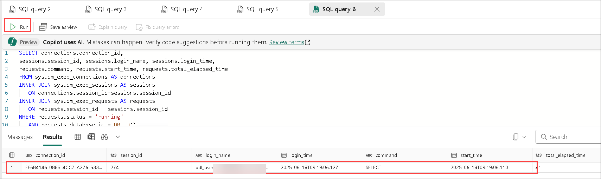
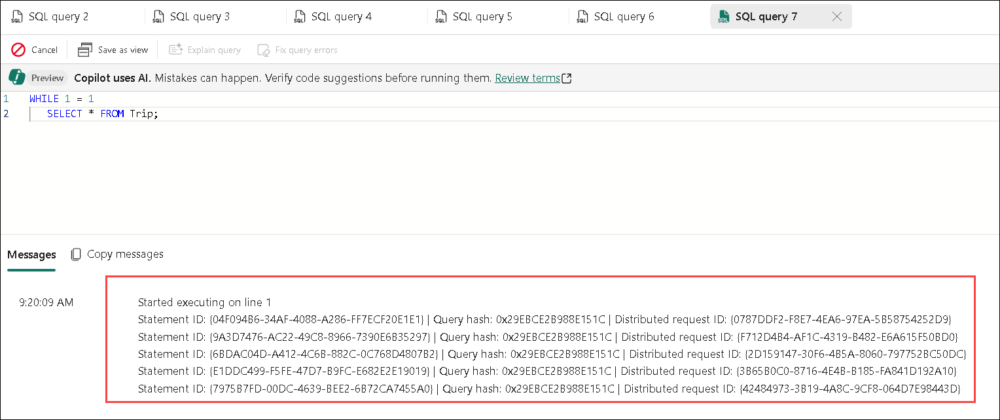
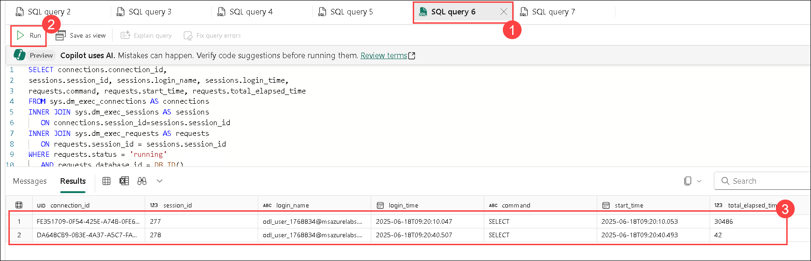

# Lab 4: Monitor a data warehouse in Microsoft Fabric

## Estimated duration: 30 minutes

In Microsoft Fabric, a data warehouse provides a relational database for large-scale analytics. Data warehouses in Microsoft Fabric include dynamic management views that you can use to monitor activity and queries.

In this hands-on lab, you will explore how to monitor a data warehouse in Microsoft Fabric. You will use dynamic management views (DMVs) to monitor current activity, running sessions, and queries. Additionally, you will use query insights to analyze historical query performance and trends within the data warehouse.

## Lab Objectives

In this lab, you will complete the following tasks:

- Task 1: Explore dynamic management views
- Task 2: Explore query insights

## Task 1: Explore dynamic management views

Microsoft Fabric data warehouses include dynamic management views (DMVs), which you can use to identify current activity in the data warehouse instance.

In this task, you will query dynamic management views such as `sys.dm_exec_connections`, `sys.dm_exec_sessions`, and `sys.dm_exec_requests` to monitor active sessions, connections, and running queries. You will also simulate a long-running query and observe it through the DMVs.

1. In the **sample-dw** data warehouse page, in the **New SQL query** drop-down list, select **New SQL query**.

1. In the new blank query pane, enter the following Transact-SQL code to query the **sys.dm_exec_connections** DMV:

    ```sql
   SELECT * FROM sys.dm_exec_connections;
    ```

1. Use the **&#9655; Run** button to run the SQL script and view the results, which include details of all connections to the data warehouse.

1. Modify the SQL code to query the **sys.dm_exec_sessions** DMV, like this:

    ```sql
   SELECT * FROM sys.dm_exec_sessions;
    ```

1. Run the modified query and view the results, which show details of all authenticated sessions.

1. Modify the SQL code to query the **sys.dm_exec_requests** DMV, like this:

    ```sql
   SELECT * FROM sys.dm_exec_requests;
    ```

1. Run the modified query and view the results, which show details of all requests being executed in the data warehouse.

1. Modify the SQL code to join the DMVs and return information about currently running requests in the same database, like this:

    ```sql
   SELECT connections.connection_id,
    sessions.session_id, sessions.login_name, sessions.login_time,
    requests.command, requests.start_time, requests.total_elapsed_time
   FROM sys.dm_exec_connections AS connections
   INNER JOIN sys.dm_exec_sessions AS sessions
       ON connections.session_id=sessions.session_id
   INNER JOIN sys.dm_exec_requests AS requests
       ON requests.session_id = sessions.session_id
   WHERE requests.status = 'running'
       AND requests.database_id = DB_ID()
   ORDER BY requests.total_elapsed_time DESC;
    ```

1. Run the modified query and view the results, which show details of all running queries in the database (including this one).

    

1. In the **New SQL query** drop-down list, select **New SQL query** to add a second query tab. Then in the new empty query tab, run the following code:

    ```sql
   WHILE 1 = 1
       SELECT * FROM Trip;
    ```

         

1. Leave the query running, and return to the tab containing the code to query the DMVs **(1)** and re-run it **(2)**. This time, the results should include the second query that is running in the other tab **(3)**. Note the elapsed time for that query.

    

1. Wait a few seconds and re-run the code to query the DMVs again. The elapsed time for the query in the other tab should have increased.
1. Return to the second query tab where the query is still running and select **Cancel** to cancel it.
1. Back on the tab with the code to query the DMVs, re-run the query to confirm that the second query is no longer running.
1. Close all query tabs.

> **Further Information**: See [Monitor connections, sessions, and requests using DMVs](https://learn.microsoft.com/fabric/data-warehouse/monitor-using-dmv) in the Microsoft Fabric documentation for more information about using DMVs.

## Task 2: Explore query insights

Microsoft Fabric data warehouses provide *query insights* - a special set of views that provide details about the queries being run in your data warehouse.

In this task, you will explore the `queryinsights` schema views such as `exec_requests_history`, `frequently_run_queries`, and `long_running_queries` to analyze historical query executions and performance statistics.

1. In the **sample-dw** data warehouse page, in the **New SQL query** drop-down list, select **New SQL query**.
1. In the new blank query pane, enter the following Transact-SQL code to query the **exec_requests_history** view:

    ```sql
   SELECT * FROM queryinsights.exec_requests_history;
    ```

1. Use the **&#9655; Run** button to run the SQL script and view the results, which include details of previously executed queries.

1. Modify the SQL code to query the **frequently_run_queries** view, like this:

    ```sql
   SELECT * FROM queryinsights.frequently_run_queries;
    ```

1. Run the modified query and view the results, which show details of frequently run queries.
1. Modify the SQL code to query the **long_running_queries** view, like this:

    ```sql
   SELECT * FROM queryinsights.long_running_queries;
    ```

1. Run the modified query and view the results, which show details of all queries and their durations.

> **Further Information**: See [Query insights in Fabric data warehousing](https://learn.microsoft.com/fabric/data-warehouse/query-insights) in the Microsoft Fabric documentation for more information about using query insights.

## Review

In this lab, you learned:

- Exploring dynamic management views.
- Exploring query insights.

## Now, click on Next from the lower right corner to move on to the next lab.

