# Lab 1: Get started with Real-Time Intelligence in Microsoft Fabric

## Estimated Duration: 30 minutes

In this lab, you will explore the Real-Time Intelligence capabilities in Microsoft Fabric by working with live stock market data. You will learn how to ingest streaming data, perform real-time analysis, and visualize the results to gain immediate insights from continuously updating information.

## Lab Objectives

In this lab, you will be able to complete the following tasks:

- Task 1: Create an eventstream
- Task 2: Create an eventhouse
- Task 3: Query the captured data
- Task 4: Create a real-time dashboard
- Task 5: Create an alert


### Task 1: Create an eventstream

In this task, you will create an eventstream in Microsoft Fabric using the Real-Time Hub. This will allow you to connect to a real-time stock market data source and stream the incoming events through a visual canvas. 

> **Tip**: The first time you use the Real-Time Hub, some *getting started* tips may be displayed. You can close these.

1. From the **left menu** bar or the **... (ellipsis)(1)** menu, select the **Real-Time (2)** hub.

   >**Info**: The real-time hub provides an easy way to find and manage sources of streaming data.

    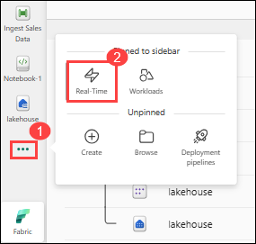

1. In the real-time hub, in the **Connect to** section, select **Data sources (1)**.

1. Find the **Stock market** sample data source and select **Connect (2)**. Then in the **Connect** wizard, name the source `stock` (3) and edit the default eventstream name to change it to `stock-data` (4). The default stream associated with this data will automatically be named *stock-data-stream* (5):

    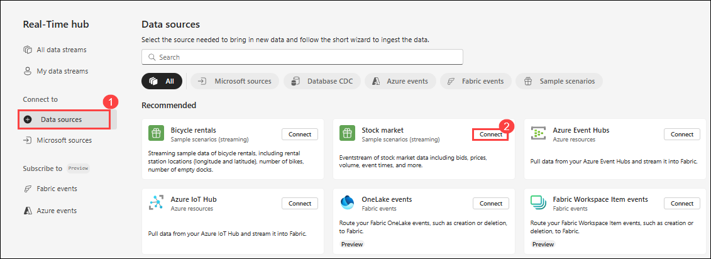

    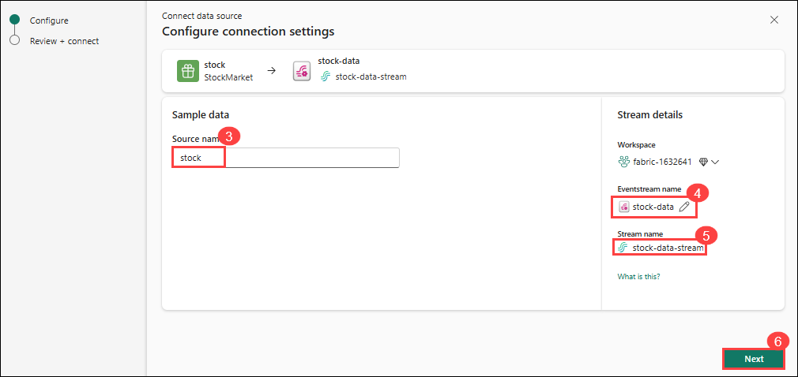

1. Select **Next (6)** and select **Connect (7)** and wait for the source and eventstream to be created, then select **Open eventstream (8)**. The eventstream will show the **stock** source and the **stock-data-stream** on the design canvas:

    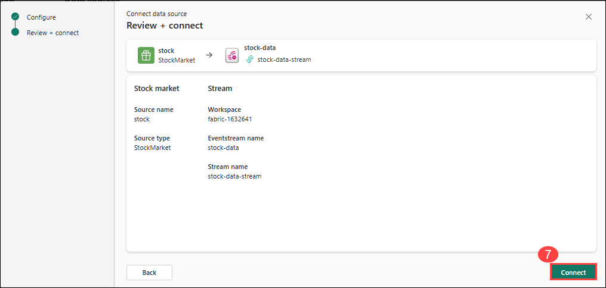

    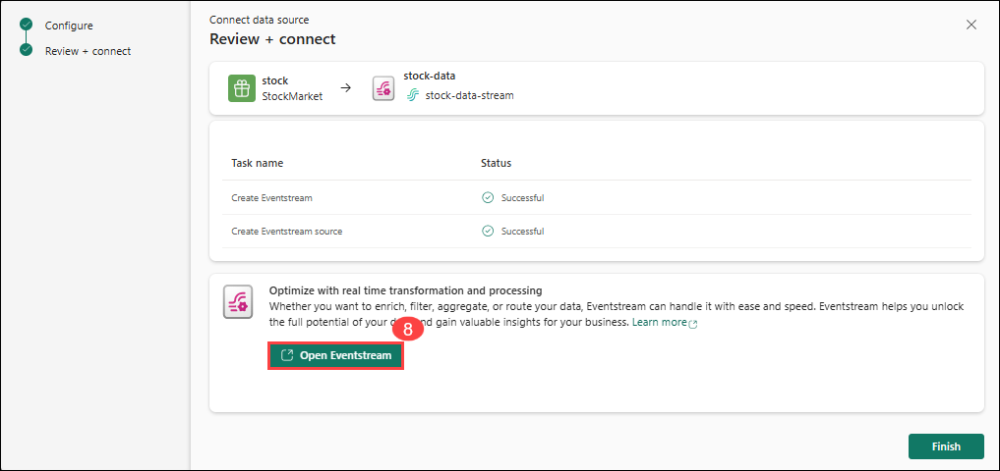

    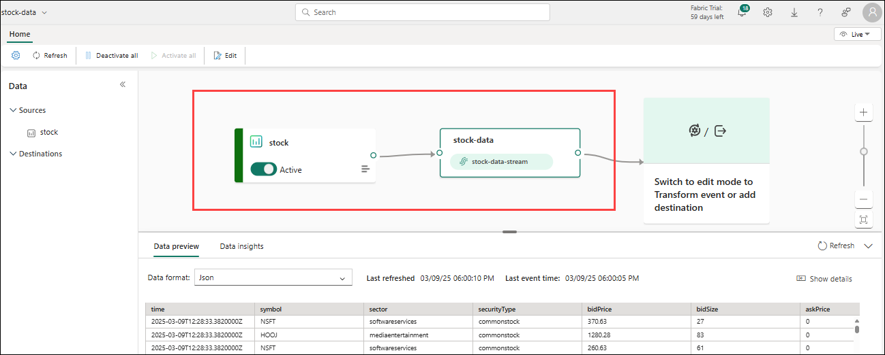

### Task 2: Create an eventhouse

In this task, you will create an eventhouse in Microsoft Fabric to store the ingested real-time stock market data. The eventhouse will serve as a structured destination for your streaming events, allowing you to persist and later analyze the data using KQL or SQL. By linking your eventstream to the eventhouse, you can capture live data into tables for deeper insight and reporting.

1. In the left menu bar, click the ellipsis (...) (1) option and select Create (2). On the New page, navigate to the Real-Time Intelligence section and choose Eventhouse (3). 

    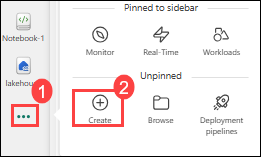

    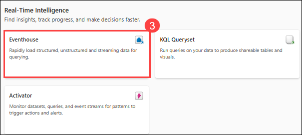

1. Enter **Stockeventhouse (4)** in the **Name** field and click on **Create (5)**

    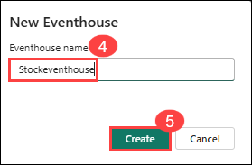

1. In the pane on the left, note that your eventhouse contains a KQL database with the same name as the eventhouse. You can create tables for your real-time data in this database, or create additional databases as necessary.

    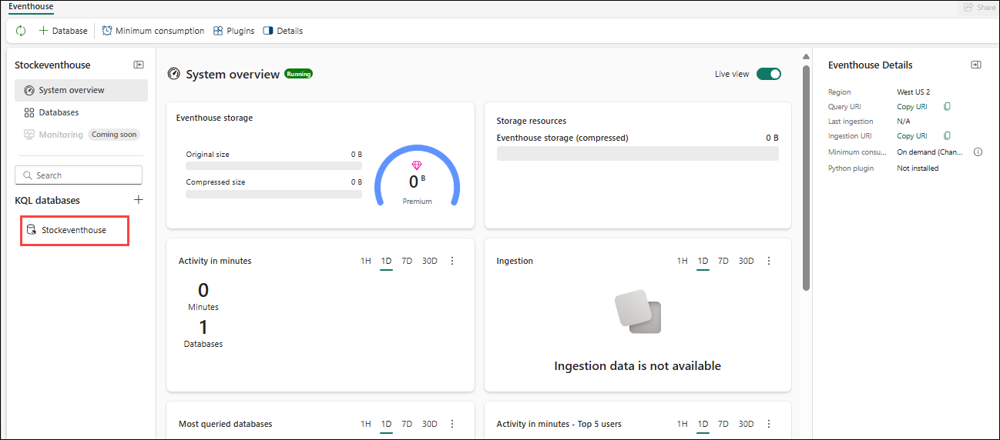

1. Select the database, and note that there is an associated *queryset*. This file contains some sample KQL queries that you can use to get started querying the tables in your database.

    However, currently there are no tables to query. Let's resolve that problem by getting data from the eventstream into a new table.

1. In the main page of your KQL database, select **Get data (1)**.

1. For the data source, select **Eventstream (2)** > **Existing eventstream (3)**.

    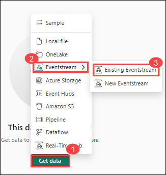

1. In the **Select or create a destination table** pane, create a new table named `stock` (1). Then in the **Configure the data source** pane, select your **workspace (2)** and the **stock-data (3)** eventstream and name the connection `stock-table` (4).

   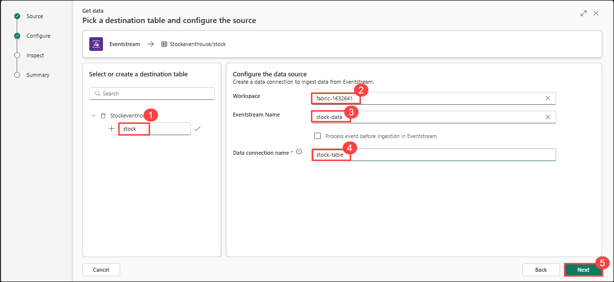

1. Use the **Next (5)** button to complete the steps to inspect the data and then finish the configuration. Then close the configuration window to see your eventhouse with the stock table.

   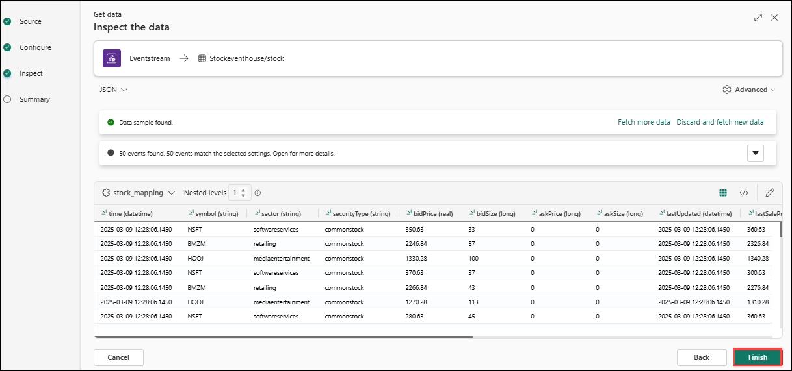

   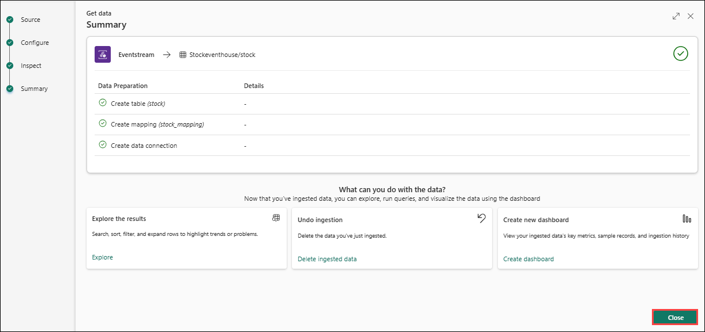

   >**Note**: The connection between the stream and the table has been created. Let's verify that in the eventstream.

1. In the menu bar on the left, select the **Real-Time** hub and then view the **My data streams** page. In the **...** menu for the **stock-data-stream** stream, select **Open eventstream**. The eventstream now shows a destination for the stream

   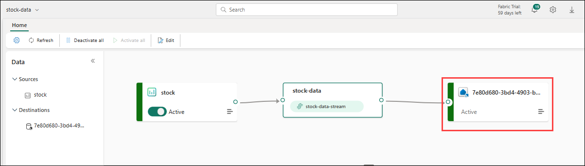

    > **Tip**: Select the destination on the design canvas, and if no data preview is shown beneath it, select **Refresh**.

    In this exercise, you've created a very simple eventstream that captures real-time data and loads it into a table. In a real soltuion, you'd typically add transformations to aggregate the data over temporal windows (for example, to capture the average price of each stock over five-minute periods).

    Now let's explore how you can query and analyze the captured data.

### Task 3: Query the captured data

In this task, you will query the real-time stock market data that has been ingested and stored in your eventhouse table. By using Kusto Query Language (KQL), you can analyze the data directly within Microsoft Fabric to identify trends, patterns, or anomalies in the streaming data. This allows for immediate insights and supports real-time decision-making scenarios.


1. In the menu bar on the left, select your eventhouse database.
1. Select the *queryset* for your database.
1. In the query pane, modify the first example query as shown here:

    ```kql
    stock
    | take 100
    ```

1. Select the query code and run it to see 100 rows of data from the table.

    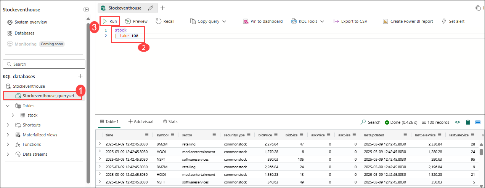

1. Review the results, then modify the query to retrieve the average price for each stock symbol in the last 5 minutes:

    ```kql
    stock
    | where ["time"] > ago(5m)
    | summarize avgPrice = avg(todecimal(bidPrice)) by symbol
    | project symbol, avgPrice
    ```

1. Highlight the modified query and run it to see the results.
1. Wait a few seconds and run it again, noting that the average prices change as new data is added to the table from the real-time stream.

### Task 4 : Create a real-time dashboard

In this task, you will create a real-time dashboard to visualize the data flowing into your eventhouse table. This enables you to monitor key metrics and trends as they happen, using visualizations that automatically update with incoming data. Real-time dashboards are a powerful way to turn continuous data streams into actionable insights.

1. In the query editor, select the **KQL query (1)**you used to retrieve the average stock prices for the last five minutes.

1. On the toolbar, select **Pin to dashboard (2)**. Then pin the query **in a new dashboard (3)** with the following settings:

    - **Dashboard name**: `Stock Dashboard` (4)
    - **Tile name**: `Average Prices` (5)

    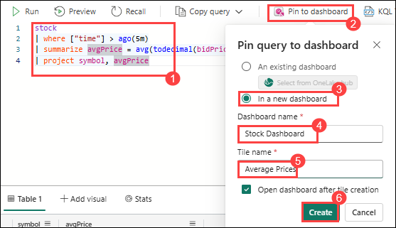

1. **Create (6)** the dashboard and open it. It should look like this:

    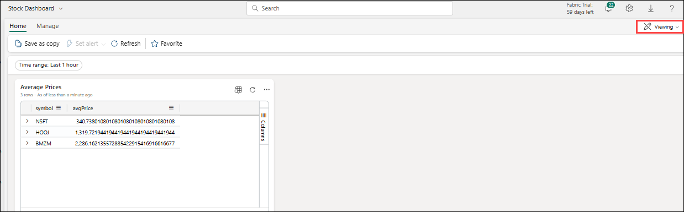

1. At the top of the dashboard, switch from **Viewing** mode to **Editing** mode.

1. Select the **Edit** (*pencil*) icon for the **Average Prices** tile.

1. In the **Visual formatting** pane, change the **Visual** from *Table* to *Column chart (1)*:

    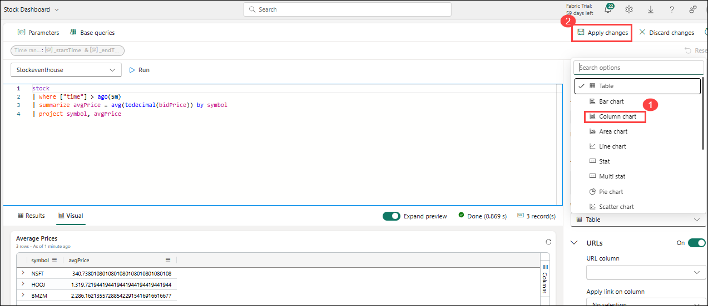

1. At the top of the dashboard, select **Apply changes (2)** and view your modified dashboard:

    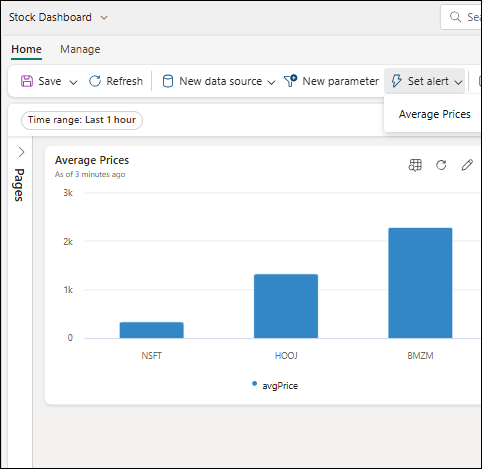

    >**Note**: Now you have a live visualization of your real-time stock data.

### Task 5: Create an alert

In this task, you will create a real-time alert using Microsoft Fabric's Activator feature. Activator allows you to define conditions that monitor streaming data and automatically trigger actions when those conditions are met. You'll set up a rule to alert you when the average stock price increases beyond a certain threshold, enabling proactive responses to important changes in real-time data.

1. In the dashboard window containing your stock price visualization, in the toolbar, select **Set alert**.
1. In the **Set alert** pane, create an alert with the following settings:
    - **Run query every**: 5 minutes (1)
    - **Check**: On each event grouped by (2)
    - **Grouping field**: symbol (3)
    - **When**: avgPrice (4)
    - **Condition**: Increases by (5)
    - **Value**: 100 (6)
    - **Action**: Send me an email (7)
    - **Save location**:
        - **Workspace**: **fabric-<inject key="DeploymentID" enableCopy="false"/>** (8)
        - **Item**: Create a new item (9)
        - **New item name**: *A unique name of your choice* (10)

    

    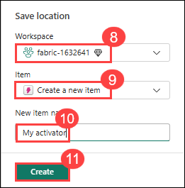

1. **Create (10)** the alert and wait for it to be saved. Then close the pane confirming it has been created.

   >**Note**: Alert creation is still in preview. If you encounter errors while saving, ignore them and proceed to the next lab.

1. In the menu bar on the left, select the page for your workspace (saving any unsaved changes to your dashboard if prompted).
1. On the workspace page, view the items you have created in this exercise, including the activator for your alert.
1. Open the activator, and in its page, under the **avgPrice** node, select the unique identifier for your alert. Then view its **History** tab.

    Your alert may not have been triggered, in which case the history will contain no data. If the average stock price ever changes by more than 100, the activator will send you an email and the alert will be recorded in the history.


## Review

In this lab, you worked through the end-to-end process of implementing real-time analytics using Microsoft Fabric's Real-Time Intelligence features. You created an eventstream to ingest live stock market data, configured an eventhouse to store the streaming data, and queried it using KQL. You also visualized the data with a real-time dashboard and created an alert using Activator to monitor key events in the data stream.

In this lab, you have completed the following tasks:

- Created an eventstream
- Created an eventhouse
- Queried the captured data
- Created a real-time dashboard
- Created an alert

## Now, click on Next from the lower right corner to move on to the next lab.
