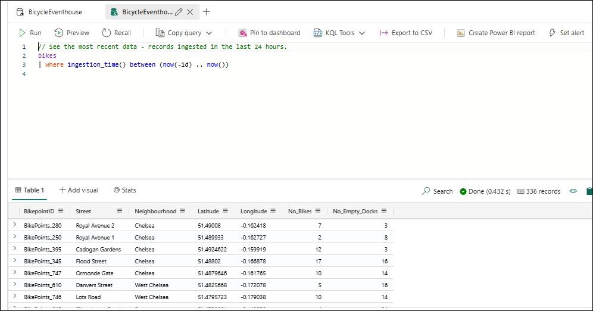
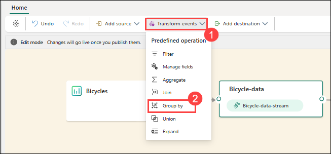
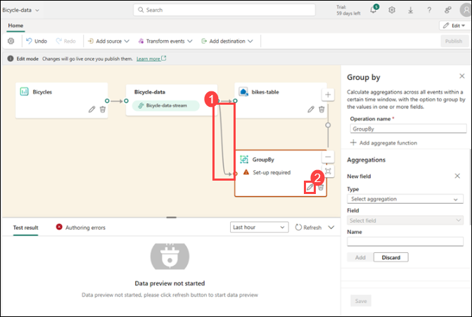
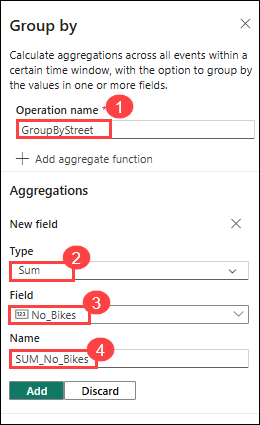
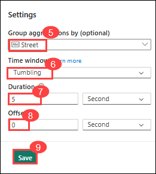
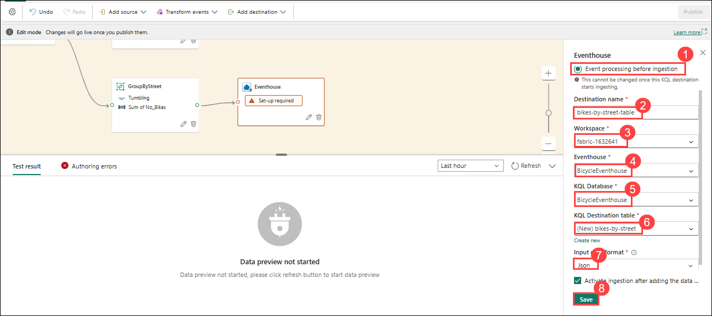
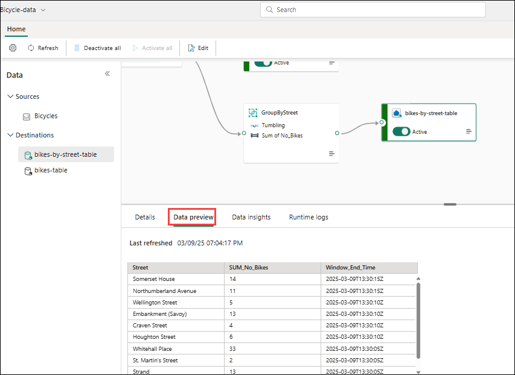
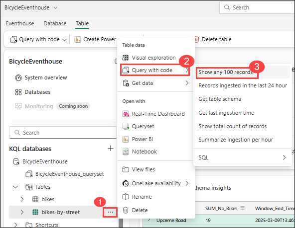
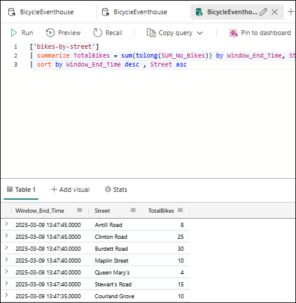

# Lab 1: Ingest real-time data with Eventstream in Microsoft Fabric

## Estimated Duration: 60 Minutes 

In this lab, you will use Microsoft Fabric's Eventstream feature to ingest and process real-time data related to a city bike-share system. You'll connect to a sample streaming data source that emits events about bicycle collection points, apply transformations, and route the processed data to various destinations. This lab demonstrates how Eventstream enables real-time analytics by capturing and handling live event data efficiently within Microsoft Fabric.

## Lab Objectives

In this lab, you will be able to complete the following tasks:

- Task 1: Create an eventhouse
- Task 2: Create an Eventstream
- Task 3: Add a source
- Task 4: Add a destination
- Task 5: Query captured data
- Task 6: Transform event data
- Task 7: Query the transformed data

### Task 1: Create an eventhouse

In this task, you will create an eventhouse in your Fabric workspace to store real-time event data.

1. In the workspace, select **+ New item (1)**. In the *New item* pane, select **Eventhouse (2)**.

    

1. Enter **BicycleEventhouse (1)** in the name field and select **Create (2)**

    

1. Close any tips or prompts that are displayed until you see your new empty eventhouse.

1. In the pane on the left, note that your eventhouse contains a KQL database with the same name as the eventhouse.

1. Select the KQL database to view it.

    

    >**Note**: Currently there are no tables in the database. In the rest of this exercise you'll use an eventstream to load data from a real-time source into a table.

### Task 2: Create an Eventstream

In this task, you will create a new Eventstream in Microsoft Fabric to start capturing real-time data. The Eventstream acts as a pipeline that ingests and processes streaming data from various sources.

1. In the main page of your **KQL database (1)**, select **Get data (2)**.

2. For the data source, select **Eventstream (3)** > **New eventstream (4)**. Name the Eventstream `Bicycle-data` (5) and click on **Create (6)**.

   >**Note**: The creation of your new event stream in the workspace will be completed in just a few moments. Once established, you will be automatically redirected to the primary editor, ready to begin integrating sources into your event stream.

    

    

    

### Task 3: Add a source

In this task, you will add a real-time data source to your Eventstream. You'll use sample data related to bicycle collection points in a city’s bike-share system. This allows you to simulate a real-world streaming scenario without needing an external data feed. 

1. In the Eventstream canvas, select **Use sample data**.

2. Name the source `Bicycles` (1), and select the **Bicycles (2)** sample data and select **Add (3)**

    

   >**Note**: Your stream will be mapped and you will be automatically displayed on the **eventstream canvas**.

   

### Task 4: Add a destination

In this task, you'll route the incoming bicycle stream data to an Eventhouse so that it can be stored for analysis.

1. Select the **Transform events or add destination (1)** tile and search for **Eventhouse (2)**.

   

1. In the **Eventhouse** pane, configure the following setup options.

   - **Data ingestion mode:**: Event processing before ingestion (1)
   - **Destination name:** `bikes-table` (2)
   - **Workspace:** fabric-<inject key="DeploymentID" enableCopy="false"/> (3)
   - **Eventhouse**: BicycleEventhouse (4)
   - **KQL database:** BicycleEventhouse (5)
   - **Destination table:** Create a new table named `bikes` 
   - **Input data format:** JSON (9)

   

   

   

1. In the **Eventhouse** pane, select **Save (10)**

1. On the toolbar, select **Publish**.

   

1. Wait a minute or so for the data destination to become active. Then select the **bikes-table** node in the design canvas and view the **Data preview** pane underneath to see the latest data that has been ingested:

   

1. Wait a few minutes and then use the **Refresh** button to refresh the **Data preview** pane. The stream is running perpetually, so new data may have been added to the table.

1. Beneath the eventstream design canvas, view the **Data insights** tab to see details of the data events that have been captured.

### Task 5: Query captured data

In this task, you will query the data stored in the eventhouse to analyze real-time observations from the bike-share system. Using KQL (Kusto Query Language), you can explore the contents of the bikes table, review the structure of the ingested data, and verify that data is being correctly captured from the stream. 

1. In the menu bar on the left, select your **BicycleEventhouse (1)** KQL database.

1. On the **database** tab, in the toolbar for your KQL database, use the **Refresh** button to refresh the view until you see the **bikes** table (2) under the database. Then select the **bikes** table.

   

1. In the **...** (3) menu for the **bikes** table, select **Query with code (4)** > **Records ingested in the last 24 hours (5)**.

1. In the query pane, note that the following query has been generated and run, with the results shown beneath:

    ```kql
    // See the most recent data - records ingested in the last 24 hours.
    bikes
    | where ingestion_time() between (now(-1d) .. now())
    ```

1. Select the query code and run it to see 100 rows of data from the table.

    

### Task 6: Transform event data

In this task, you will apply a transformation to the incoming event data within the eventstream before it reaches the destination. This allows you to clean, shape, or enrich the data in real time. 

1. In the menu bar on the left, select the **Bicycle-data** eventstream.

1. On the toolbar, select **Edit** to edit the eventstream.

1. In the **Transform events (1)** menu, select **Group by (2)** to add a new **Group by** node to the eventstream.

    

1. Drag a connection from the output of the **Bicycle-data** node to the input of the new **Group by** node Then use the *pencil* icon in the **Group by** node to edit it.

   

1. Configure out the properties of the **Group by** settings section:
    - **Operation name:** GroupByStreet (1)
    - **Aggregate type:** *Select* Sum (2)
    - **Field:** *select* No_Bikes (3). *Then select **Add** to create the function* SUM of No_Bikes (4)
    - **Group aggregations by (optional):** Street (5)
    - **Time window**: Tumbling (6)
    - **Duration**: 5 seconds (7)
    - **Offset**: 0 seconds (8)

    > **Note**: This configuration will cause the eventstream to calculate the total number of bicycles in each street every 5 seconds.

   

   
      
1. **Save** the configuration and return to the eventstream canvas, where an error is indicated (because you need to store the output from the transformation somewhere!).

1. Use the **+** icon to the right of the **GroupByStreet** node to add a new **Eventhouse** node.

1. Configure the new eventhouse node with the following options:

   - **Data ingestion mode:**: Event processing before ingestion (1)
   - **Destination name:** `bikes-by-street-table` (2)
   - **Workspace:** *fabric-<inject key="DeploymentID" enableCopy="false"/>* (3)
   - **Eventhouse**: *BicycleEventhouse* (4)
   - **KQL database:** *BicycleEventhouse* (5)
   - **Destination table:** Create a new table named `bikes-by-street` (6)
   - **Input data format:** JSON (7)

    

1. In the **Eventhouse** pane, select **Save (8)**. 
1. On the toolbar, select **Publish**.
1. Wait a minute or so for the changes to become active.
1. In the design canvas, select the **bikes-by-street-table** node, and view the **data preview** pane beneath the canvas.

    

    **Note**: The trasformed data includes the grouping field you specified (**Street**), the aggregation you specified (**SUM_no_Bikes**), and a timestamp field indicating the end of the 5 second tumbling window in which the event occurred (**Window_End_Time**).

### Task 7: Query the transformed data

In this task, you'll query the transformed bicycle data that has been ingested into your eventhouse table through the eventstream. Using KQL (Kusto Query Language), you can explore the structured data to gain insights, verify your transformations, and begin your real-time analysis.

1. In the menu bar on the left, select your KQL database.
1. On the **database** tab, in the toolbar for your KQL database, use the **Refresh** button to refresh the view until you see the **bikes-by-street** table under the database.

1. In the **... (1)** menu for the **bikes-by-street** table, select **Query with code (2)** > **Show any 100 records (3)**.

    

1. In the query pane, note that the following query is generated and run:

    ```kql
    ['bikes-by-street']
    | take 100
    ```

1. Modify the KQL query to retrieve the total number of bikes per street within each 5 second window:

    ```kql
    ['bikes-by-street']
    | summarize TotalBikes = sum(tolong(SUM_No_Bikes)) by Window_End_Time, Street
    | sort by Window_End_Time desc , Street asc
    ```

1. Select the modified query and run it.

    The results show the number of bikes observed in each street within each 5 second time period.

    

## Review

In this lab, you worked through the end-to-end process of capturing and analyzing real-time data using Eventstream in Microsoft Fabric. You created an eventhouse, configured sources and destinations, and applied transformations to event data. You also queried both raw and transformed data, gaining practical experience in building a real-time analytics pipeline.

In this lab, you have completed the following tasks:

- Created an eventhouse
- Created an Eventstream
- Added a source
- Added a destination
- Queried captured data
- Transformed event data
- Queried the transformed data

## Now, click on Next from the lower right corner to move on to the next lab.


