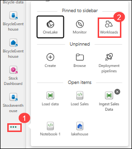
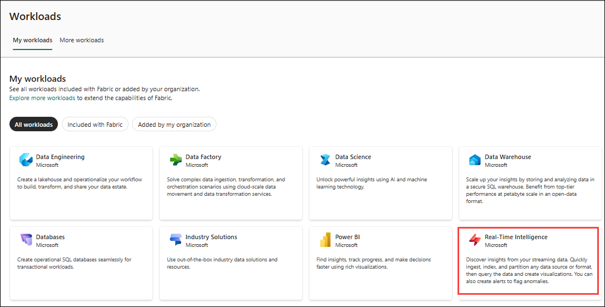
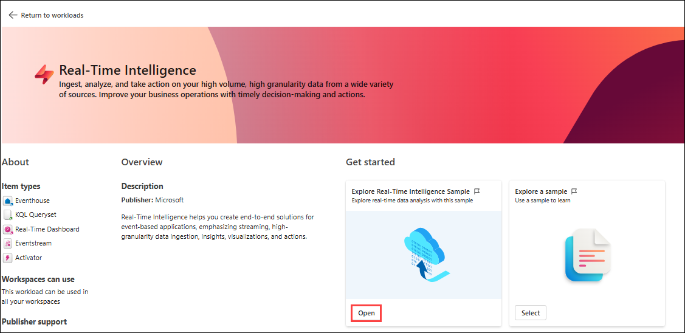
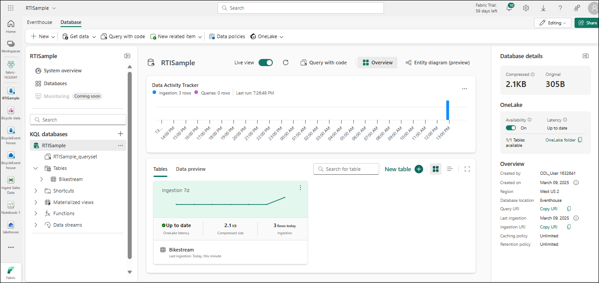
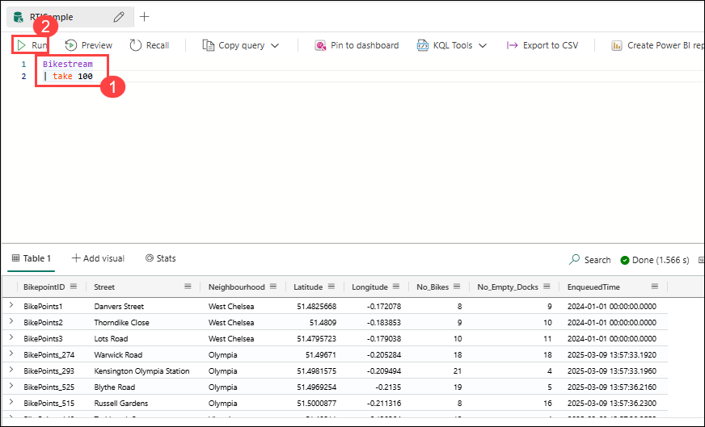

# Lab 3: Work with data in a Microsoft Fabric eventhouse

## Estimated Duration: 30 minutes

In this lab, you will create and populate an eventhouse in Microsoft Fabric using sample data related to taxi rides. You will configure an eventstream to ingest real-time data into your eventhouse and then explore the captured data using both Kusto Query Language (KQL) and SQL. This lab will help you understand how to manage and analyze real-time event data in a structured, queryable format.

## Lab Objectives

In this lab, you will be able to complete the following tasks:

- Task 1: Create an Eventhouse
- Task 2: Query data by using KQL
- Task 3: Create a DataframeQuery data by using Transact-SQL

### Task 1: Create an Eventhouse

In this task, you will create an eventhouse in your Fabric workspace. The eventhouse will serve as the storage location for real-time data captured from streaming sources.

1. In the menu bar on the left, select **Workloads**. Then, select the **Real-Time Intelligence** tile.

   

   

1. On the **Real-Time Intelligence** home page, select the **Explore Real-Time Intelligence Sample** tile and click on **Open** It will automatically create an eventhouse called **RTISample**:

   

   

1. In the pane on the left, note that your eventhouse contains a KQL database with the same name as the eventhouse.

1. Verify that a **Bikestream** table has also been created.

### Task 2: Query data by using KQL

In this task, you will use Kusto Query Language (KQL) to explore and analyze data stored in your eventhouse. KQL is a powerful query language optimized for time-series and event data, making it ideal for analyzing the real-time taxi ride data you've ingested.

### Retrieve data from a table with KQL

1. In the left pane of the eventhouse window, under your KQL database, select the default **queryset** file. This file contains some sample KQL queries to get you started.
1. Modify the first example query as follows.

    ```kql
    Bikestream
    | take 100
    ```

    > **NOTE:**
    > The Pipe ( | ) character is used for two purposes in KQL including to separate query operators in a tabular expression statement. It is also used as a logical OR operator within square or round brackets to denote that you may specify one of the items separated by the pipe character.

1. Select the query code and run it to return 100 rows from the table.

   

    You can be more precise by adding specific attributes you want to query using the `project` keyword and then using the `take` keyword to tell the engine how many records to return.

1. Type, select, and run the following query:

    ```kql
    // Use 'project' and 'take' to view a sample number of records in the table and check the data.
    Bikestream
    | project Street, No_Bikes
    | take 10
    ```

    > **NOTE:** The use of // denotes a comment.

    Another common practice in the analysis is renaming columns in our queryset to make them more user-friendly.

1. Try the following query:

    ```kql
    Bikestream 
    | project Street, ["Number of Empty Docks"] = No_Empty_Docks
    | take 10
    ```

### Summarize data by using KQL

You can use the *summarize* keyword with a function to aggregate and otherwise manipulate data.

1. Try the following query, which uses the **sum** function to summarize the rental data to see how many bikes are available in total:

    ```kql

    Bikestream
    | summarize ["Total Number of Bikes"] = sum(No_Bikes)
    ```

    You can group the summarized data by a specified column or expression.

1. Run the following query to group the number of bikes by neighbourhood to determine the amount of available bikes in each neighbourhood:

    ```kql
    Bikestream
    | summarize ["Total Number of Bikes"] = sum(No_Bikes) by Neighbourhood
    | project Neighbourhood, ["Total Number of Bikes"]
    ```

    If any of the bike points has a null or empty entry for neighbourhood, the results of summarization will include a blank value, which is never good for analysis.

1. Modify the query as shown here to use the *case* function along with the *isempty* and *isnull* functions to group all trips for which the neighbourhood is unknown into a ***Unidentified*** category for follow-up.

    ```kql
    Bikestream
    | summarize ["Total Number of Bikes"] = sum(No_Bikes) by Neighbourhood
    | project Neighbourhood = case(isempty(Neighbourhood) or isnull(Neighbourhood), "Unidentified", Neighbourhood), ["Total Number of Bikes"]
    ```

    >**Note**: As this sample dataset is well-maintained, you might not have an Unidentified field in the query result.

### Sort data by using KQL

To make more sense of our data, we typically order it by a column, and this process is done in KQL with either a *sort by* or *order by* operator (they act the same way).

1. Try the following query:

    ```kql
    Bikestream
    | summarize ["Total Number of Bikes"] = sum(No_Bikes) by Neighbourhood
    | project Neighbourhood = case(isempty(Neighbourhood) or isnull(Neighbourhood), "Unidentified", Neighbourhood), ["Total Number of Bikes"]
    | sort by Neighbourhood asc
    ```

1. Modify the query as follows and run it again, and note that the *order by* operator works the same way as *sort by*:

    ```kql
    Bikestream
    | summarize ["Total Number of Bikes"] = sum(No_Bikes) by Neighbourhood
    | project Neighbourhood = case(isempty(Neighbourhood) or isnull(Neighbourhood), "Unidentified", Neighbourhood), ["Total Number of Bikes"]
    | order by Neighbourhood asc
    ```

### Filter data by using KQL

In KQL, the *where* clause is used to filter data. You can combine conditions in a *where* clause by using *and* and *or* logical operators.

1. Run the following query to filter the bike data to include only bike points in the Chelsea neighbourhood:

    ```kql
    Bikestream
    | where Neighbourhood == "Chelsea"
    | summarize ["Total Number of Bikes"] = sum(No_Bikes) by Neighbourhood
    | project Neighbourhood = case(isempty(Neighbourhood) or isnull(Neighbourhood), "Unidentified", Neighbourhood), ["Total Number of Bikes"]
    | sort by Neighbourhood asc
    ```

### Task 3: Query data by using Transact-SQL

In this task, you used Transact-SQL (T-SQL) to query data stored in a KQL database through the provided T-SQL endpoint. While the support is limited compared to native SQL Server, it enables integration with tools and systems that rely on T-SQL, offering basic querying capabilities like aggregations and filtering. However, for full functionality and better performance, KQL remains the recommended language for working with eventhouse data.


### Retrieve data from a table by using Transact-SQL

1. In your queryset, add and run the following Transact-SQL query: 

    ```sql
    SELECT TOP 100 * from Bikestream
    ```

1. Modify the query as follows to retrieve specific columns

    ```sql
    SELECT TOP 10 Street, No_Bikes
    FROM Bikestream
    ```

1. Modify the query to assign an alias that renames **No_Empty_Docks** to a more user-friendly name.

    ```sql
    SELECT TOP 10 Street, No_Empty_Docks as [Number of Empty Docks]
    from Bikestream
    ```

### Summarize data by using Transact-SQL

1. Run the following query to find the total number of bikes available:

    ```sql
    SELECT sum(No_Bikes) AS [Total Number of Bikes]
    FROM Bikestream
    ```

1. Modify the query to group the total number of bikes by neighbourhood:

    ```sql
    SELECT Neighbourhood, Sum(No_Bikes) AS [Total Number of Bikes]
    FROM Bikestream
    GROUP BY Neighbourhood
    ```

1. Modify the query further to use a *CASE* statement to group bike points with an unknown origin into a ***Unidentified*** category for follow-up. 

    ```sql
    SELECT CASE
             WHEN Neighbourhood IS NULL OR Neighbourhood = '' THEN 'Unidentified'
             ELSE Neighbourhood
           END AS Neighbourhood,
           SUM(No_Bikes) AS [Total Number of Bikes]
    FROM Bikestream
    GROUP BY CASE
               WHEN Neighbourhood IS NULL OR Neighbourhood = '' THEN 'Unidentified'
               ELSE Neighbourhood
             END;
    ```

### Sort data by using Transact-SQL

1. Run the following query to order the grouped results by neighbourhood:
 
    ```sql
    SELECT CASE
             WHEN Neighbourhood IS NULL OR Neighbourhood = '' THEN 'Unidentified'
             ELSE Neighbourhood
           END AS Neighbourhood,
           SUM(No_Bikes) AS [Total Number of Bikes]
    FROM Bikestream
    GROUP BY CASE
               WHEN Neighbourhood IS NULL OR Neighbourhood = '' THEN 'Unidentified'
               ELSE Neighbourhood
             END
    ORDER BY Neighbourhood ASC;
    ```

### Filter data by using Transact-SQL
    
1. Run the following query to filter the grouped data so that only rows having a neighbourhood of "Chelsea" are included in the results

    ```sql
    SELECT CASE
             WHEN Neighbourhood IS NULL OR Neighbourhood = '' THEN 'Unidentified'
             ELSE Neighbourhood
           END AS Neighbourhood,
           SUM(No_Bikes) AS [Total Number of Bikes]
    FROM Bikestream
    GROUP BY CASE
               WHEN Neighbourhood IS NULL OR Neighbourhood = '' THEN 'Unidentified'
               ELSE Neighbourhood
             END
    HAVING Neighbourhood = 'Chelsea'
    ORDER BY Neighbourhood ASC;
    ```


## Review

In this lab, you worked with real-time data using an eventhouse in Microsoft Fabric. You created an eventhouse, queried the ingested data using Kusto Query Language (KQL), and explored the use of the Transact-SQL (T-SQL) endpoint to run SQL-based queries. This exercise helped reinforce how to store, access, and analyze streaming data in a flexible and powerful way.

In this lab, you have completed the following tasks:

- Created an Eventhouse
- Queried data by using KQL
- Created a DataframeQuery data by using Transact-SQL

## You have successfully completed the lab


