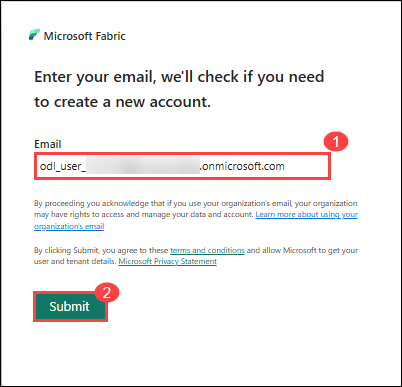
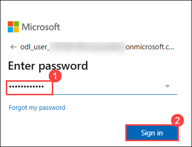
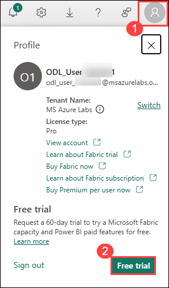
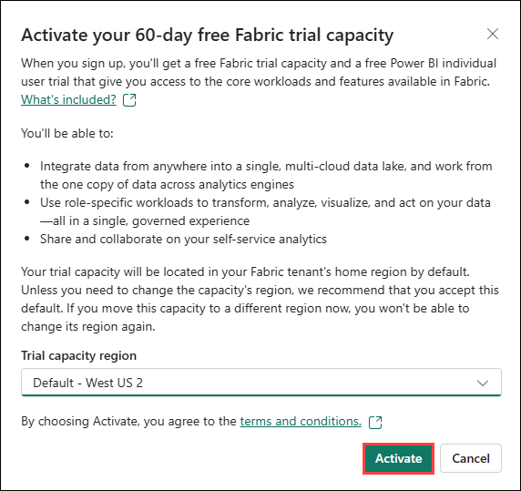
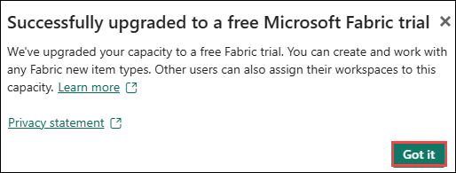
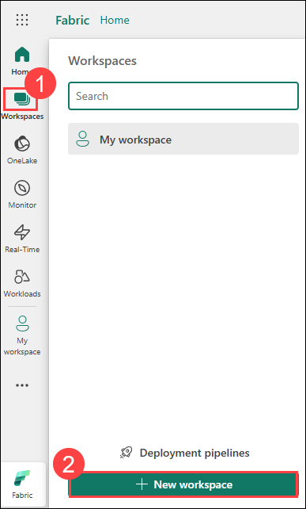
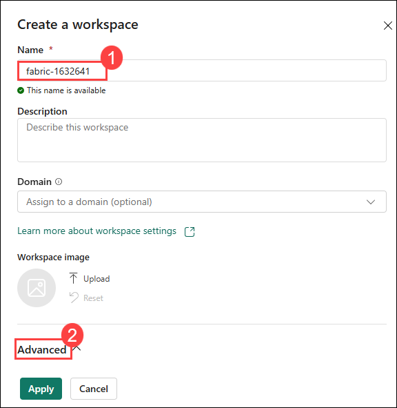
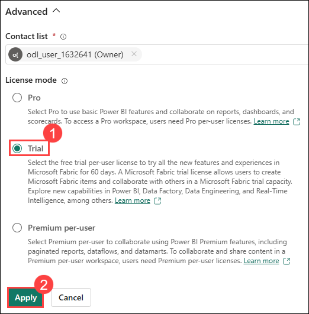

# Lab: pre-requiste: Create a Fabric workspace

### Estimated Duration: 15 minutes

In this exercise, you will go through the process of signing up for the Microsoft Fabric Trial and setting up a workspace. This serves as the initial step in familiarizing yourself with the Microsoft Fabric platform. By creating a workspace, you will establish a dedicated environment where you can explore and interact with the wide range of tools and services Microsoft Fabric offers, including data integration, analytics, and visualization. This foundational setup is essential for understanding how to manage and organize resources within Fabric, as well as how to collaborate effectively across teams and projects within the platform.

## Lab objectives

In this lab, you will be able to complete the following tasks:

- Task 1: Sign up for Microsoft Fabric Trial
- Task 2: Create a workspace

### Task 1: Sign up for Microsoft Fabric Trial

In this task, you will initiate your 60-day free trial of Microsoft Fabric by signing up through the Fabric app, providing access to its comprehensive suite of data integration, analytics, and visualization tools

1. Open the **Microsoft Edge** browser in the LabVM, navigate to the following URL  

   ```
   https://app.fabric.microsoft.com/home?experience=fabric-developer
   ```

1. Enter below Email and click on **Submit (2)**:
 
   - **Email/Username:** <inject key="AzureAdUserEmail"></inject> (1)
    
     
 
1. Next, provide below password and click on **Sign in (2)**
 
   - **Password:** <inject key="AzureAdUserPassword"></inject> (1)
 
     

1. On **Stay signed in?** pop-up window appears, click on **Yes**.

### Activate the Microsoft Fabric Free Trial  

1. In the Fabric portal, click on **Account Manager (1)** and then select **Free trial (2)**.

      

2. In the prompt that appears, click **Activate** to start your **60-day free Fabric trial**.  

     

3. Once the trial is successfully activated, click **Got it** on the confirmation prompt.  

     

### Task 2: Create a workspace

In this task, you will create a Fabric workspace. The workspace contains all the items needed for this tutorial, which includes lakehouse, dataflows, Data Factory pipelines, notebooks, Power BI datasets, and reports.

1. From the left menu bar, select **Workspaces (1)** and click on **+ New workspace (2)**.

    

1. On **Create a workspace** window, enter the below name and expand the **Advanced (2)** setttings

   - **Name:** Enter **fabric-<inject key="DeploymentID" enableCopy="false"/>** (1)

    

1. Under **License mode**, select the **Trial (1)** and click on **Apply (2)**

    

### Summary

In this exercise, you have signed up for Microsoft Fabric Trial and created a workspace.

### Review 
In this lab, you have completed:

 + Signed up for Microsoft Fabric Trial
 + Created a workspace

### You have successfully completed the lab. Click on Next >> to procced with next Lab.
