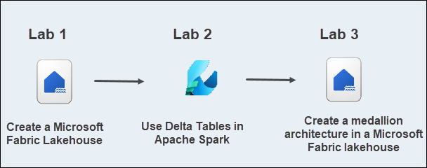
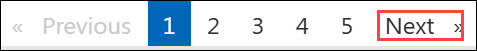

# DP-700: Microsoft-Fabric-Data-Engineer Workshop

Welcome to your DP-700: Microsoft-Fabric-Data-Engineer Workshop! We've prepared a seamless environment for you to explore and learn Azure Services. Let's begin by making the most of this experience.

### Overall Estimated timing: 3 hrs

In this hands-on lab, you’ll explore foundational and advanced data engineering concepts using Microsoft Fabric Lakehouse. You will start by creating a lakehouse and understanding its role in modern data architecture. Then, you'll dive into working with Delta Tables using Apache Spark to enable reliable and scalable data processing. Finally, you’ll build a medallion architecture—organizing data into bronze, silver, and gold layers—to streamline data transformation and analytics. By the end, you'll gain practical skills to manage and analyze data using lakehouse architecture in Microsoft Fabric.

## Objectives

By the end of this lab series, you will be able to create and manage a Microsoft Fabric lakehouse, work with Delta Tables using Apache Spark, and design a medallion architecture with bronze, silver, and gold layers for structured data processing.

1. **Create a Microsoft Fabric Lakehouse**: You will learn how to create a lakehouse in Microsoft Fabric that combines the flexibility of a data lake with the structured querying capabilities of a data warehouse. This task will walk you through creating a workspace, setting up the lakehouse, and understanding how data is stored and organized using tables backed by files.

1. **Use Delta Tables in Apache Spark**: You will explore how Delta Lake technology enhances data reliability and performance within a Fabric lakehouse. This task guides you through creating Delta tables using Apache Spark, performing SQL queries, and understanding how Delta Lake supports ACID transactions and time travel features for efficient data analytics.

1. **Create a medallion architecture in a Microsoft Fabric lakehouse**: You will learn to implement the medallion architecture pattern, which structures data in layered stages: bronze (raw), silver (cleaned), and gold (aggregated). This task involves transforming data across these layers using notebooks and Apache Spark, helping ensure organized, scalable, and insightful data processing in Microsoft Fabric.

## Pre-requisites

- Familiarity with data concepts such as tables, data transformation, and querying.
- Some experience with Apache Spark and data processing using notebooks (Python or SQL).
- Ability to read and write simple Python or SQL queries for data manipulation and analysis.
- Familiarity with concepts like data lakes, Delta tables, and medallion architecture will be helpful.

## Architecture

In this hands-on lab, the architecture flow includes several essential components.

1. **Create a Microsoft Fabric Lakehouse**: Learning how to create a lakehouse in Microsoft Fabric to unify the capabilities of a data lake and data warehouse. This includes setting up a centralized storage location for structured and unstructured data and preparing it for large-scale analytics and processing tasks.

1. **Use Delta Tables in Apache Spark**:
Exploring how to use Delta Tables within Microsoft Fabric to manage large datasets with ACID compliance and schema enforcement. This task involves creating Delta tables using Spark, querying them with SQL, and understanding how they support both batch and streaming data operations efficiently.

1. **Create a medallion architecture in a Microsoft Fabric lakehouse**:
Implementing the medallion architecture model (bronze, silver, and gold layers) to organize data workflows in a Fabric lakehouse. This includes using Spark notebooks to transform raw data through each layer, enhancing data quality, optimizing performance, and making it ready for analytics and reporting.

## Architecture Diagram

 

## Explanation of Components

1. **Fabric Lakehouse**: A Fabric Lakehouse is a data architecture in Microsoft Fabric that combines the features of a data lake and a data warehouse into a unified platform. It enables organizations to store, manage, and analyze structured, semi-structured, and unstructured data at scale using familiar tools and languages like SQL, Apache Spark, and Python.

1. **Apache Spark**: It is an open-source, distributed computing engine designed for fast and large-scale data processing. It’s widely used in big data environments for tasks such as data transformation, machine learning, and real-time analytics. 

1. **Medallion architecture**: It is a design pattern that organizes data into three layers (Bronze, Silver, and Gold) to improve data quality and structure as it progresses through each stage, facilitating optimized analytics. 

# Getting Started with lab
 
Welcome to your DP-700: Microsoft Fabric Data Engineer Workshop! We've prepared a seamless environment for you to explore and learn about data engineering concepts and related Microsoft Fabric services. Let's begin by making the most of this experience:
 
## Accessing Your Lab Environment
 
Once you're ready to dive in, your virtual machine and **lab guide** will be right at your fingertips within your web browser.
 

### Virtual Machine & Lab Guide
 
Your virtual machine is your workhorse throughout the workshop. The lab guide is your roadmap to success.

## Exploring Your Lab Resources
 
To get a better understanding of your lab resources and credentials, navigate to the **Environment** tab.
 

## Lab Guide Zoom In/Zoom Out
 
To adjust the zoom level for the environment page, click the **A↕: 100%** icon located next to the timer in the lab environment.

## Utilizing the Split Window Feature
 
For convenience, you can open the lab guide in a separate window by selecting the **Split Window** button from the Top right corner.
 

## Managing Your Virtual Machine
 
Feel free to **start, stop, or restart (2)** your virtual machine as needed from the **Resources (1)** tab. Your experience is in your hands!
 

## Support Contact
 
The CloudLabs support team is available 24/7, 365 days a year, via email and live chat to ensure seamless assistance at any time. We offer dedicated support channels explicitly tailored for both learners and instructors, ensuring that all your needs are promptly and efficiently addressed.
 
Learner Support Contacts:
 
- Email Support: cloudlabs-support@spektrasystems.com
- Live Chat Support: https://cloudlabs.ai/labs-support

Click on **Next** from the lower right corner to move on to the next page.

   

## Happy Learning !!
