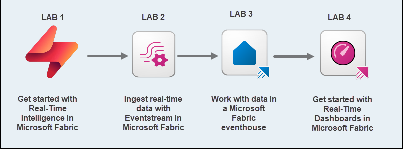
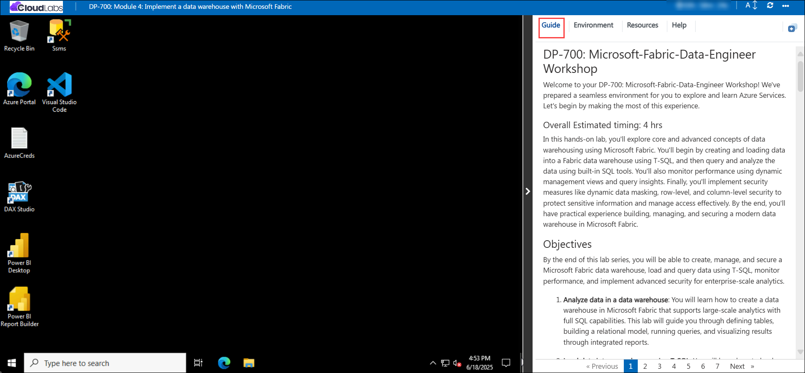
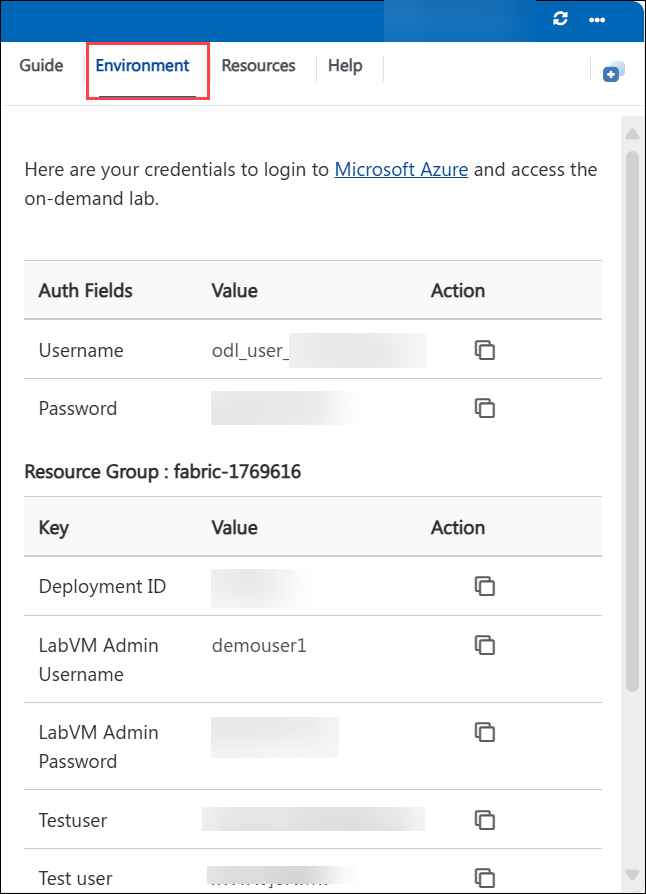
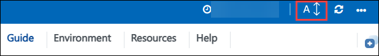
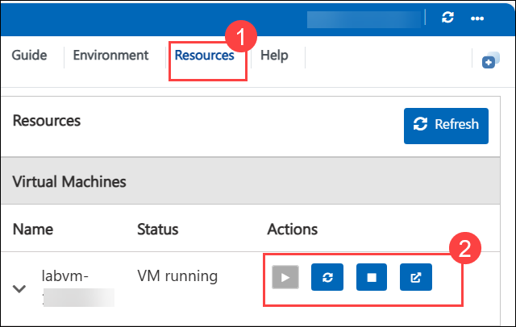

# DP-700: Microsoft-Fabric-Data-Engineer Workshop

Welcome to your DP-700: Microsoft-Fabric-Data-Engineer Workshop! We've prepared a seamless environment for you to explore and learn Azure Services. Let's begin by making the most of this experience.

### Overall Estimated timing: 210 minutes

In this hands-on labs, you'll explore Real-Time Intelligence capabilities in Microsoft Fabric. Starting with live stock market data, you'll learn to ingest, process, and visualize streaming data for instant insights. You'll work with Eventstream to handle real-time city bike-share data, then create and query an eventhouse using KQL and SQL. Finally, you'll build a dynamic real-time dashboard to visualize streaming data, enabling interactive and up-to-date analytics. These labs provide a practical foundation for implementing real-time analytics solutions in Microsoft Fabric.

## Objectives

By the end of this lab series, you will be able to leverage Microsoft Fabric's Real-Time Intelligence features to ingest and process live streaming data using Eventstream, manage and query real-time event data within an eventhouse, and build interactive dashboards with Kusto Query Language (KQL). You will gain hands-on experience in configuring real-time data pipelines, applying transformations, and visualizing continuously updating data to support immediate, data-driven decision-making.

1. **Get started with Real-Time Intelligence in Microsoft Fabric**: You will explore the core components of Real-Time Intelligence in Microsoft Fabric by working with live stock market data. You’ll learn how to ingest streaming data, analyze it in real time, and visualize insights through dynamic dashboards and alerts.

1. **Ingest real-time data with Eventstream in Microsoft Fabric**: You will explore how Microsoft Fabric’s Eventstream feature enables real-time data ingestion and processing. Using data from a city bike-share system, you’ll configure sources and destinations, apply transformations, and analyze the data to support real-time decision-making.

1. **Work with data in a Microsoft Fabric eventhouse**: You will learn how to create and work with an eventhouse in Microsoft Fabric using real-time taxi ride data. You'll configure an eventstream to ingest data and then explore the captured events using both Kusto Query Language (KQL) and SQL, helping you gain practical skills in querying and analyzing structured streaming data.

1. **Get started with Real-Time Dashboards in Microsoft Fabric**: You will learn to build a complete real-time streaming solution by creating an interactive dashboard in Microsoft Fabric. Using data from bicycle-related event streams, you'll visualize live data using Kusto Query Language (KQL), configure dashboard settings, and enable collaborative features for sharing insights. 

## Pre-requisites

- Basic knowledge of Microsoft Fabric, including creating and managing workspaces and resources
- Familiarity with real-time data concepts and event-driven architecture
- Understanding of how to create and configure Eventstream pipelines, including setting up sources and destinations
- Experience with querying data using Kusto Query Language (KQL) and SQL
- Ability to create and customize dashboards for data visualization, including adding parameters and configuring auto-refresh settings

## Architecture

In this hands-on lab, the architecture flow includes several essential components.

1. **Get started with Real-Time Intelligence in Microsoft Fabric**:  Exploring how to build a real-time analytics solution using Microsoft Fabric’s Real-Time Intelligence features. This includes ingesting live stock market data through an eventstream, analyzing it using Kusto Query Language (KQL), and visualizing insights with a real-time dashboard and alerts to support immediate decision-making.

1. **Ingest real-time data with Eventstream in Microsoft Fabric**: Learn how to use Eventstream in Microsoft Fabric to capture, transform, and route real-time event data. This includes connecting to a live bike-share data source, applying transformations within the stream, and directing the processed data to multiple destinations such as an eventhouse or Lakehouse for further analysis.

1. **Work with data in a Microsoft Fabric eventhouse**: Learn how to create and use an eventhouse in Microsoft Fabric to store and query real-time event data. This task involves populating the eventhouse with sample taxi ride data and using KQL and SQL to analyze the information.

1. **Create a Real-Time Dashboard in Microsoft Fabric**: Developing a real-time dashboard to visualize and monitor live data from an eventstream. This task helps in creating responsive dashboards for instant insights and better decision-making based on streaming data.

## Architecture Diagram

 

## Explanation of Components

1. **Real-time Intelligence**: It is an end-to-end solution for event-driven scenarios, streaming data, and data logs.

1. **Eventstream**: A data pipeline in Microsoft Fabric that ingests, processes, and routes streaming data from sources like Event Hub or IoT Hub.

1. **Eventhouse**: An eventhouse is a workspace of databases, which might be shared across a certain project.

1. **Real-Time Dashboard**: A dynamic visualization tool that displays live data from eventstreams, enabling instant monitoring and insights.

# Getting Started with lab
 
Welcome to your DP-700: Microsoft Fabric Data Engineer Workshop! We've prepared a seamless environment for you to explore and learn about data engineering concepts and related Microsoft Fabric services. Let's begin by making the most of this experience:
 
## Accessing Your Lab Environment
 
Once you're ready to dive in, your virtual machine and **Guide** will be right at your fingertips within your web browser.
 

### Virtual Machine & Lab Guide
 
Your virtual machine is your workhorse throughout the workshop. The lab guide is your roadmap to success.

## Exploring Your Lab Resources
 
To get a better understanding of your lab resources and credentials, navigate to the **Environment** tab.
 

## Lab Guide Zoom In/Zoom Out
 
To adjust the zoom level for the environment page, click the **A↕: 100%** icon located next to the timer in the lab environment.

## Utilizing the Split Window Feature
 
For convenience, you can open the lab guide in a separate window by selecting the **Split Window** button from the Top right corner.
 

## Managing Your Virtual Machine
 
Feel free to **start, stop, or restart (2)** your virtual machine as needed from the **Resources (1)** tab. Your experience is in your hands!
 

## Support Contact
 
The CloudLabs support team is available 24/7, 365 days a year, via email and live chat to ensure seamless assistance at any time. We offer dedicated support channels explicitly tailored for both learners and instructors, ensuring that all your needs are promptly and efficiently addressed.
 
Learner Support Contacts:
 
- Email Support: cloudlabs-support@spektrasystems.com
- Live Chat Support: https://cloudlabs.ai/labs-support

Click on **Next** from the lower right corner to move on to the next page.

   

## Happy Learning !!
